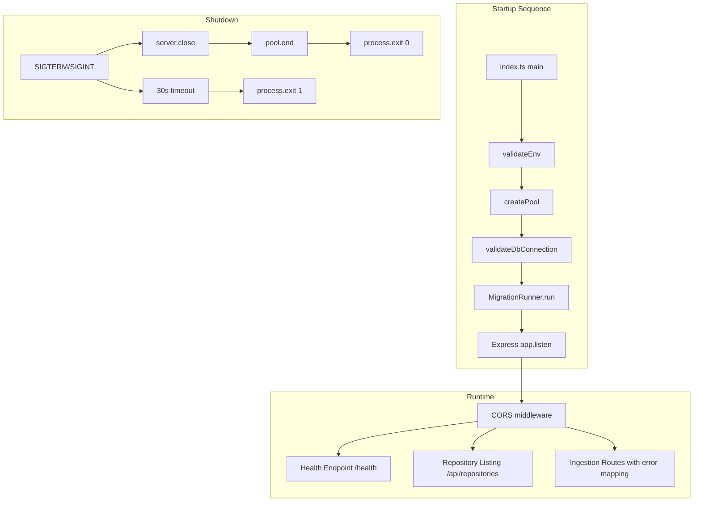

# Design Document: Backend Setup

## Overview

This design addresses the missing operational infrastructure for the Repository Metadata Dashboard backend. The existing codebase has well-structured adapters, parsers, scanners, services, and API routes, but lacks automated database schema initialization, environment validation, a repository listing endpoint, a health check that verifies dependencies, structured ingestion error reporting, configurable CORS, and graceful shutdown with timeout enforcement.

All changes integrate into the existing Express/TypeScript architecture in `backend/src/`, reusing the established patterns: factory-function routers, `RepositoryDb` as the data access layer, `Pool` from `pg`, and the `ApiError` response shape.

## Architecture

The design introduces the following new components into the existing architecture:



The startup sequence is strictly ordered: environment validation → pool creation → DB connection test → migration execution → HTTP server start. Any failure in this chain prevents the server from accepting requests.

## Components and Interfaces

### 1. MigrationRunner (`backend/src/db/MigrationRunner.ts`)

Responsible for reading SQL files from `backend/src/db/migrations/`, tracking applied migrations in a `schema_migrations` table, and executing pending ones in sorted order.

```typescript
interface MigrationRunner {
  /**
   * Execute all pending migrations. Creates schema_migrations table if needed.
   * Returns the count of newly applied migrations.
   * Throws on failure, preventing server startup.
   */
  run(pool: Pool): Promise<number>;
}
```

Implementation details:
- Creates `schema_migrations` table on first run using `CREATE TABLE IF NOT EXISTS`
- Reads `*.sql` files from the migrations directory, sorted by filename
- Compares against `schema_migrations.filename` to find pending migrations
- Executes each pending migration inside a transaction
- Inserts a row into `schema_migrations` after each successful migration
- Logs the count of newly applied migrations
- On failure: logs the error with the failing filename and re-throws

### 2. Environment Validator (`backend/src/config/validateEnv.ts`)

A pure function that validates required environment variables at startup.

```typescript
interface EnvValidationResult {
  isValid: boolean;
  errors: string[];
  warnings: string[];
}

function validateEnv(env: Record<string, string | undefined>): EnvValidationResult;
```

Validation rules:
- Either `DATABASE_URL` or the combination of `PG_HOST` + `PG_DATABASE` + `PG_USER` must be set
- If `TOKEN_ENCRYPTION_KEY` is provided, it must be exactly 32 bytes (64 hex chars or valid base64 decoding to 32 bytes)
- If `TOKEN_ENCRYPTION_KEY` is absent, emit a warning (token management endpoints disabled)
- Returns structured result with errors and warnings; caller decides whether to exit

### 3. Database Connection Validator

A function in `backend/src/db/validateConnection.ts` that runs a lightweight test query.

```typescript
async function validateDbConnection(pool: Pool): Promise<void>;
```

- Executes `SELECT 1` against the pool
- On success: logs confirmation message
- On failure: logs descriptive error including configured host/port, then throws

### 4. Repository Listing Endpoint

Adds a `GET /api/repositories` handler to the existing `repositoryRoutes.ts`. This is a new route on the existing router.

```typescript
// Added to createRepositoryRouter
router.get('/', async (req: Request, res: Response) => { ... });
```

- Calls a new `RepositoryDb.listRepositories()` method
- Returns JSON array with fields: `id`, `name`, `sourceType`, `sourceIdentifier`, `createdAt`, `updatedAt`
- Returns `[]` with 200 when no repositories exist
- Returns 500 with `ApiError { code: "INTERNAL_ERROR" }` on DB errors

### 5. Health Endpoint Enhancement

Replaces the current static `/health` handler with one that verifies database connectivity.

```typescript
// In index.ts or a dedicated healthRoutes.ts
app.get('/health', async (req: Request, res: Response) => {
  try {
    await pool.query('SELECT 1');
    res.status(200).json({ status: 'ok', database: 'connected' });
  } catch {
    res.status(503).json({ status: 'degraded', database: 'disconnected' });
  }
});
```

### 6. Ingestion Error Mapping Middleware

Enhances the ingestion route's catch block to map adapter-specific errors (`GitHubApiError`, `AzureDevOpsApiError`) to structured HTTP responses.

```typescript
function mapIngestionError(error: unknown): { status: number; body: ApiError };
```

Mapping rules:
| Error code | HTTP Status | ApiError.code |
|---|---|---|
| `AUTH_ERROR` | 401 | `AUTH_ERROR` |
| `RATE_LIMIT_EXCEEDED` | 429 | `RATE_LIMIT_EXCEEDED` |
| `NOT_FOUND` | 404 | `NOT_FOUND` |
| Other | 500 | `INTERNAL_ERROR` |

The `provider` field is populated from the adapter error's name (e.g., "github", "azure_devops"). The `retryAfter` field is populated for rate-limit errors.

### 7. CORS Configuration

Replaces the current `cors()` call with a configured instance.

```typescript
const corsOrigin = process.env.CORS_ORIGIN || '*';
app.use(cors({ origin: corsOrigin }));
```

- When `CORS_ORIGIN` is set: restricts to that origin
- When unset: allows all origins (development default)
- Express `cors` middleware handles preflight OPTIONS automatically

### 8. Graceful Shutdown Enhancement

Enhances the existing shutdown handler with a 30-second timeout.

```typescript
function shutdown(signal: string) {
  console.log(`Received ${signal}. Shutting down gracefully...`);

  const forceTimeout = setTimeout(() => {
    console.error('Graceful shutdown timed out after 30s. Forcing exit.');
    process.exit(1);
  }, 30_000);
  forceTimeout.unref();

  server.close(() => {
    pool.end().then(() => {
      clearTimeout(forceTimeout);
      console.log('Database pool closed.');
      process.exit(0);
    }).catch((err) => {
      console.error('Error closing database pool:', err);
      process.exit(1);
    });
  });
}
```

## Data Models

### schema_migrations table

```sql
CREATE TABLE IF NOT EXISTS schema_migrations (
    filename VARCHAR(255) PRIMARY KEY,
    applied_at TIMESTAMPTZ NOT NULL DEFAULT NOW()
);
```

This table is created by the MigrationRunner itself, not by a migration file, to avoid a chicken-and-egg problem.

### EnvValidationResult

```typescript
interface EnvValidationResult {
  isValid: boolean;
  errors: string[];    // Fatal: missing DATABASE_URL/PG_*, invalid TOKEN_ENCRYPTION_KEY
  warnings: string[];  // Non-fatal: missing TOKEN_ENCRYPTION_KEY
}
```

### Health Response

```typescript
// 200 OK
{ status: 'ok', database: 'connected' }

// 503 Service Unavailable
{ status: 'degraded', database: 'disconnected' }
```

### Repository Listing Response

Reuses the existing `Repository` interface from `models/types.ts`:

```typescript
// GET /api/repositories → 200
Repository[] // Array of { id, name, sourceType, sourceIdentifier, createdAt, updatedAt }
```

### Ingestion Error Response

Reuses the existing `ApiError` interface, with `provider` and `retryAfter` fields populated as appropriate:

```typescript
interface ApiError {
  code: string;
  message: string;
  provider?: string;
  retryAfter?: number;
}
```


## Correctness Properties

*A property is a characteristic or behavior that should hold true across all valid executions of a system — essentially, a formal statement about what the system should do. Properties serve as the bridge between human-readable specifications and machine-verifiable correctness guarantees.*

### Property 1: Migrations execute in sorted order and are tracked

*For any* set of SQL migration files with distinct filenames, after the MigrationRunner executes, the `schema_migrations` table should contain exactly those filenames, and the order of `applied_at` timestamps should match the lexicographic sort order of the filenames.

**Validates: Requirements 1.1, 1.2, 1.5**

### Property 2: Migration runner is idempotent

*For any* set of migration files, running the MigrationRunner twice should result in the second run applying zero new migrations, and the `schema_migrations` table should remain unchanged between the first and second run.

**Validates: Requirements 1.3**

### Property 3: Failed migration prevents completion

*For any* set of migration files where at least one contains invalid SQL, the MigrationRunner should throw an error, and only migrations preceding the failing one (in sorted order) should be recorded in `schema_migrations`.

**Validates: Requirements 1.4**

### Property 4: Repository listing returns all stored repositories with required fields

*For any* set of repositories stored in the database, a GET request to `/api/repositories` should return a JSON array of the same length, where each element contains the fields `id`, `name`, `sourceType`, `sourceIdentifier`, `createdAt`, and `updatedAt`, and the set of returned `id` values matches the set of stored repository IDs.

**Validates: Requirements 3.1, 3.2**

### Property 5: Environment validation rejects missing database configuration

*For any* environment object that lacks both `DATABASE_URL` and at least one of `PG_HOST`, `PG_DATABASE`, or `PG_USER`, the `validateEnv` function should return `isValid: false` with at least one error string that names the missing variable(s).

**Validates: Requirements 4.1, 4.3**

### Property 6: Environment validation rejects invalid TOKEN_ENCRYPTION_KEY

*For any* string provided as `TOKEN_ENCRYPTION_KEY` that is neither 64 hexadecimal characters nor a valid base64 string decoding to exactly 32 bytes, the `validateEnv` function should return `isValid: false` with an error naming `TOKEN_ENCRYPTION_KEY`.

**Validates: Requirements 4.2, 4.3**

### Property 7: Ingestion error mapping produces correct HTTP status and error shape

*For any* adapter error with code `AUTH_ERROR`, `RATE_LIMIT_EXCEEDED`, `NOT_FOUND`, or any other code, the `mapIngestionError` function should return the corresponding HTTP status (401, 429, 404, or 500 respectively) and an `ApiError` object with the matching `code`, and for rate-limit errors the `retryAfter` value should be preserved, and for auth/not-found errors the `provider` field should be populated.

**Validates: Requirements 6.1, 6.2, 6.3, 6.4**

### Property 8: CORS origin restriction matches configuration

*For any* non-empty string set as `CORS_ORIGIN`, the CORS middleware should set the `Access-Control-Allow-Origin` header to that exact value for requests from that origin, and should not set it to `*`.

**Validates: Requirements 7.1**

## Error Handling

### Startup Errors

| Error Condition | Behavior |
|---|---|
| Missing DB environment variables | `validateEnv` returns errors; `index.ts` logs each error and calls `process.exit(1)` |
| Invalid `TOKEN_ENCRYPTION_KEY` | `validateEnv` returns error; `index.ts` logs and calls `process.exit(1)` |
| Missing `TOKEN_ENCRYPTION_KEY` | `validateEnv` returns warning; `index.ts` logs warning, skips TokenService, continues |
| Database unreachable at startup | `validateDbConnection` throws; `index.ts` logs error with host/port and calls `process.exit(1)` |
| Migration file fails | `MigrationRunner.run` throws; `index.ts` logs the failing filename and calls `process.exit(1)` |

### Runtime Errors

| Error Condition | HTTP Status | ApiError Code |
|---|---|---|
| `GET /api/repositories` DB error | 500 | `INTERNAL_ERROR` |
| `GET /health` DB unreachable | 503 | N/A (returns `{ status: "degraded", database: "disconnected" }`) |
| Ingestion auth error | 401 | `AUTH_ERROR` |
| Ingestion rate limit | 429 | `RATE_LIMIT_EXCEEDED` |
| Ingestion not found | 404 | `NOT_FOUND` |
| Ingestion unexpected error | 500 | `INTERNAL_ERROR` |

### Shutdown Errors

| Error Condition | Behavior |
|---|---|
| `pool.end()` fails during shutdown | Logs error, exits with code 1 |
| Shutdown exceeds 30 seconds | Force exits with code 1 |

## Testing Strategy

### Property-Based Testing

The project already includes `fast-check` (v3.19.0) as a dev dependency and uses `vitest` as the test runner. All property-based tests will use `fast-check` with a minimum of 100 iterations per property.

Each property test must be tagged with a comment referencing the design property:
```
// Feature: backend-setup, Property N: <property title>
```

Properties to implement as property-based tests:
1. **Migration ordering and tracking** — Generate random sets of migration filenames, run the MigrationRunner against an in-memory or test DB, verify `schema_migrations` contents and ordering
2. **Migration idempotence** — Run the MigrationRunner twice on the same set, verify second run returns 0
3. **Failed migration partial application** — Generate migration sets with one invalid entry, verify partial application
4. **Repository listing completeness** — Generate random repository data, insert via `RepositoryDb`, call the listing endpoint, verify all returned with correct fields
5. **Environment validation (DB config)** — Generate random env objects missing DB vars, verify validation fails with named variables
6. **Environment validation (encryption key)** — Generate random invalid key strings, verify validation rejects them
7. **Ingestion error mapping** — Generate random error codes and provider names, verify correct HTTP status and ApiError shape
8. **CORS origin restriction** — Generate random origin strings, verify header matches configuration

### Unit / Example Tests

Unit tests complement property tests for specific scenarios and edge cases:
- Health endpoint returns 200 with `{ status: "ok", database: "connected" }` when DB is up
- Health endpoint returns 503 with `{ status: "degraded", database: "disconnected" }` when DB is down
- Repository listing returns `[]` with 200 when no repositories exist
- Repository listing returns 500 with `INTERNAL_ERROR` when DB throws
- `validateEnv` emits warning (not error) when `TOKEN_ENCRYPTION_KEY` is absent
- CORS allows all origins when `CORS_ORIGIN` is not set
- CORS preflight OPTIONS returns appropriate headers
- DB connection validation logs host/port on failure
- DB connection validation logs success message on success

### Test File Organization

```
backend/src/
  config/
    validateEnv.test.ts          # Property + unit tests for env validation
  db/
    MigrationRunner.test.ts      # Property + unit tests for migration runner
    validateConnection.test.ts   # Unit tests for DB connection validation
  api/
    repositoryRoutes.test.ts     # Extend existing file with listing tests
    ingestionRoutes.test.ts      # Extend existing file with error mapping tests
    healthRoutes.test.ts         # Unit tests for health endpoint
```
