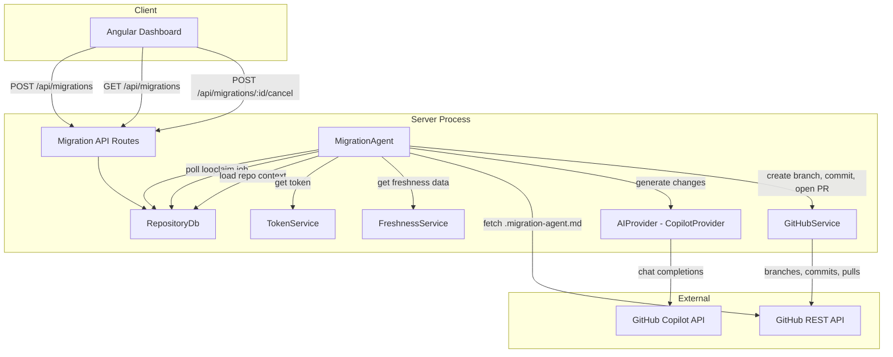

# Design Document: Background Migration Agent

## Overview

The Background Migration Agent is an AI-powered service that automates dependency upgrades and framework/SDK updates. It orchestrates a pipeline: claim a queued migration job → load repository context and agent instructions → call an AI provider (GitHub Copilot) to generate code changes → create a branch on GitHub → commit changes → open a Pull Request with an AI-generated description.

The system integrates with the existing codebase:
- Reuses the `migrations` table for job lifecycle tracking (`queued` → `running` → `completed`/`failed`)
- Uses `TokenService` to retrieve encrypted GitHub access tokens
- Reads freshness scoring data to identify outdated dependencies for `upgradeAll` mode
- Runs as an in-process poller inside the Express server, sharing the connection pool

The AI provider layer is abstracted behind an `AIProvider` interface, with a `CopilotProvider` as the default implementation. This allows future extension to Claude, Gemini, or other providers without changing the orchestration logic.

## Architecture



### Key Design Decisions

1. **In-process poller, not a separate worker.** Migration jobs are low-throughput (one at a time). Running in-process shares the connection pool and simplifies deployment. The agent can be extracted to a standalone worker later if needed.

2. **Serial job processing.** The agent processes one job at a time to avoid concurrent branch conflicts on the same repository and keep resource usage predictable.

3. **AIProvider abstraction.** The `AIProvider` interface decouples the orchestration from any specific AI service. The `CopilotProvider` is the default; adding Claude or Gemini means implementing the same interface.

4. **Separate GitHubService from GitHubAdapter.** The existing `GitHubAdapter` is a `SourceAdapter` for fetching repo contents during ingestion. The new `GitHubService` handles write operations: creating branches, committing files, and opening PRs. These are distinct responsibilities.

5. **Agent instructions from repo.** The `.migration-agent.md` file lets repository owners customize AI behavior per-repo. A built-in default covers common patterns when no custom file exists.

6. **PR description via AI.** The AI provider generates the PR description from the code changes and dependency metadata, giving reviewers a useful summary. A fallback template is used if AI description generation fails.

## Components and Interfaces

### AIProvider Interface

```typescript
interface UpgradeTarget {
  dependencyName: string;
  ecosystem: string;
  currentVersion: string;
  targetVersion?: string; // if omitted, AI determines the target
}

interface FileChange {
  filePath: string;
  originalContent: string;
  modifiedContent: string;
}

interface AIProviderRequest {
  upgradeTargets: UpgradeTarget[];
  agentInstructions: string;
  repositoryContext: {
    fileTree: FileEntry[];
    manifestContents: Record<string, string>; // path → content
    repoName: string;
  };
}

interface AIProviderResponse {
  fileChanges: FileChange[];
  prDescription: string;
  errors: Array<{ dependencyName: string; error: string }>;
}

interface AIProvider {
  generateChanges(request: AIProviderRequest): Promise<AIProviderResponse>;
}
```

The `AIProvider` receives the full context needed to generate changes: what to upgrade, how to do it (agent instructions), and the repository state (file tree + manifest contents). It returns file changes, a PR description, and per-dependency errors.

### CopilotProvider

```typescript
class CopilotProvider implements AIProvider {
  constructor(config: { apiKey: string; endpoint: string });

  async generateChanges(request: AIProviderRequest): Promise<AIProviderResponse>;
}
```

Uses the GitHub Copilot chat completions API. The system prompt includes:
- The agent instructions (from `.migration-agent.md` or defaults)
- The repository file tree
- The manifest file contents

The user prompt describes the specific upgrade targets with current and target versions.

The response is parsed to extract file changes (as structured JSON) and a PR description.

### GitHubService

```typescript
class GitHubService {
  constructor(private fetchFn?: typeof globalThis.fetch);

  /** Create a branch from the default branch HEAD */
  async createBranch(params: {
    owner: string;
    repo: string;
    branchName: string;
    token: string;
  }): Promise<void>;

  /** Commit file changes to a branch */
  async commitChanges(params: {
    owner: string;
    repo: string;
    branchName: string;
    token: string;
    changes: FileChange[];
    commitMessage: string;
  }): Promise<string>; // returns commit SHA

  /** Open a pull request */
  async createPullRequest(params: {
    owner: string;
    repo: string;
    token: string;
    head: string;
    base: string;
    title: string;
    body: string;
  }): Promise<{ prUrl: string; prNumber: number }>;

  /** Fetch a single file's content from a repo */
  async getFileContent(params: {
    owner: string;
    repo: string;
    token: string;
    path: string;
    ref?: string;
  }): Promise<string | null>; // null if file not found

  /** Get the default branch name */
  async getDefaultBranch(params: {
    owner: string;
    repo: string;
    token: string;
  }): Promise<string>;
}
```

All methods use the GitHub REST API with the provided token. The `fetchFn` parameter allows injection for testing (same pattern as `GitHubAdapter`).

### MigrationAgent

```typescript
interface MigrationAgentConfig {
  pollIntervalMs: number;        // default: 5000
  shutdownTimeoutMs: number;     // default: 60000
  dashboardBaseUrl?: string;     // for PR description links
  freshnessThreshold: number;    // default: 0.8
}

class MigrationAgent {
  constructor(
    db: RepositoryDb,
    tokenService: TokenService,
    freshnessService: FreshnessService,
    aiProvider: AIProvider,
    githubService: GitHubService,
    config?: Partial<MigrationAgentConfig>,
  );

  start(): void;
  stop(): Promise<void>;
}
```

Lifecycle:
- `start()` — enters the poll loop via `setTimeout` (not `setInterval`, to avoid overlapping ticks).
- `stop()` — sets a shutdown flag, clears the pending timer, waits for any in-flight job to complete (up to `shutdownTimeoutMs`), then resolves.

Internal flow per poll tick:
1. Call `db.claimNextJob()` — atomically claim the oldest queued `ai-upgrade` job.
2. If no job, schedule next tick and return.
3. Retrieve the GitHub token via `tokenService.getToken('github')`.
4. Load repository context: file tree, dependency manifests, freshness scores.
5. If `parameters.upgradeAll`, use freshness data to build `UpgradeTarget[]` for dependencies below threshold.
6. Fetch `.migration-agent.md` from the repo via `githubService.getFileContent()`. Fall back to default instructions if not found.
7. Call `aiProvider.generateChanges()` with the assembled request.
8. If file changes were produced:
   a. Create a branch: `migration-agent/<migration-id>-<short-description>`.
   b. Commit the changes with a descriptive message.
   c. Open a PR with the AI-generated description (including dashboard link).
9. Update the job to `completed` with the PR URL in `result`, or `failed` with error details.
10. Schedule next tick.

### RepositoryDb Extensions

```typescript
// Added to existing RepositoryDb class:

/** Atomically claim the oldest queued ai-upgrade job. Returns null if none. */
async claimNextJob(): Promise<MigrationStatus | null>;

/** Update a migration's status, result, and/or error_details. */
async updateMigrationStatus(
  id: string,
  status: MigrationStatus['status'],
  result?: string,
  errorDetails?: string,
): Promise<void>;

/** List migrations with optional filters, ordered by created_at DESC. */
async listMigrations(filters?: {
  repositoryId?: string;
  status?: string;
}): Promise<MigrationStatus[]>;

/** Cancel a queued migration. Returns true if cancelled. */
async cancelMigration(id: string): Promise<boolean>;
```

### API Route Extensions

Added to the existing `migrationRoutes.ts`:

| Method | Path | Description |
|--------|------|-------------|
| `GET` | `/api/migrations` | List migrations with optional `?repositoryId=` and `?status=` query params. Returns array ordered by `created_at` DESC. |
| `POST` | `/api/migrations/:id/cancel` | Cancel a queued migration. Returns 200 on success, 404 if not found, 409 if not in `queued` status. |

The existing `POST /api/migrations` is extended to:
- Validate `migrationType` is `ai-upgrade`
- Validate the repository is a GitHub repository (`source_type = 'github'`)
- Accept `parameters.dependencies` array or `parameters.upgradeAll` flag

### Agent Instructions Loading

The agent fetches `.migration-agent.md` from the repository root via `GitHubService.getFileContent()`. If the file is not found (404), it falls back to a built-in default prompt covering:
- Common upgrade patterns (bump version in manifest, update import paths)
- Conservative change strategy (minimal changes, preserve existing patterns)
- Test file awareness (update test dependencies too)

If `parameters.customInstructions` is provided in the migration request, it overrides both the repo-level file and the defaults.

### Server Startup Integration

In `index.ts`, after creating services:
1. Read AI provider config from env vars.
2. Create `CopilotProvider` (or skip if `AI_PROVIDER_API_KEY` not set).
3. Create `GitHubService`.
4. Create `MigrationAgent` with all dependencies.
5. Call `agent.start()`.
6. In `shutdown()`, call `agent.stop()` before closing the pool.

## Data Models

### Existing `migrations` Table (no schema changes)

```sql
CREATE TABLE migrations (
    id UUID PRIMARY KEY DEFAULT gen_random_uuid(),
    repository_id UUID NOT NULL REFERENCES repositories(id),
    migration_type VARCHAR(100) NOT NULL,
    parameters JSONB DEFAULT '{}',
    status VARCHAR(20) NOT NULL CHECK (status IN ('queued', 'running', 'completed', 'failed')),
    result TEXT,
    error_details TEXT,
    created_at TIMESTAMPTZ NOT NULL DEFAULT NOW(),
    updated_at TIMESTAMPTZ NOT NULL DEFAULT NOW()
);
```

The `parameters` JSONB column stores the upgrade request details:
```json
{
  "dependencies": [
    { "name": "express", "ecosystem": "npm", "currentVersion": "4.18.2", "targetVersion": "5.0.0" }
  ],
  "upgradeAll": false,
  "customInstructions": "..."
}
```

The `result` field stores the PR URL on success. The `error_details` field stores failure messages.

### New TypeScript Interfaces

```typescript
// Added to models/types.ts

interface UpgradeTarget {
  dependencyName: string;
  ecosystem: string;
  currentVersion: string;
  targetVersion?: string;
}

interface FileChange {
  filePath: string;
  originalContent: string;
  modifiedContent: string;
}

interface AIProviderRequest {
  upgradeTargets: UpgradeTarget[];
  agentInstructions: string;
  repositoryContext: {
    fileTree: FileEntry[];
    manifestContents: Record<string, string>;
    repoName: string;
  };
}

interface AIProviderResponse {
  fileChanges: FileChange[];
  prDescription: string;
  errors: Array<{ dependencyName: string; error: string }>;
}

interface MigrationParameters {
  dependencies?: Array<{ name: string; ecosystem?: string; targetVersion?: string }>;
  upgradeAll?: boolean;
  customInstructions?: string;
}
```

### Key SQL Patterns

**Atomic job claim:**
```sql
UPDATE migrations
SET status = 'running', updated_at = NOW()
WHERE id = (
  SELECT id FROM migrations
  WHERE status = 'queued'
  ORDER BY created_at ASC
  LIMIT 1
  FOR UPDATE SKIP LOCKED
)
RETURNING id, repository_id, migration_type, parameters, status, result, error_details, created_at, updated_at;
```

**Cancel (conditional update):**
```sql
UPDATE migrations
SET status = 'failed', error_details = 'Cancelled by user', updated_at = NOW()
WHERE id = $1 AND status = 'queued'
RETURNING id;
```

### Environment Variables

| Variable | Default | Description |
|----------|---------|-------------|
| `AI_PROVIDER_TYPE` | `copilot` | AI provider to use (`copilot`, future: `claude`, `gemini`) |
| `AI_PROVIDER_API_KEY` | — | API key for the AI provider |
| `AI_PROVIDER_ENDPOINT` | `https://api.githubcopilot.com` | API endpoint URL |
| `MIGRATION_POLL_INTERVAL_MS` | `5000` | Polling interval in milliseconds |
| `DASHBOARD_BASE_URL` | — | Base URL for dashboard links in PR descriptions |

