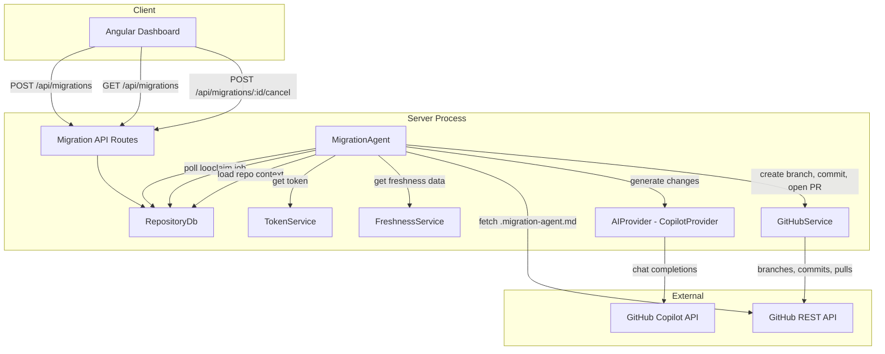

# Design Document: Background Migration Agent

## Overview

The Background Migration Agent is an AI-powered service that automates dependency upgrades and framework/SDK updates. It orchestrates a pipeline: claim a queued migration job → load repository context and agent instructions → call an AI provider (GitHub Copilot) to generate code changes → create a branch on GitHub → commit changes → open a Pull Request with an AI-generated description.

The system integrates with the existing codebase:
- Reuses the `migrations` table for job lifecycle tracking (`queued` → `running` → `completed`/`failed`)
- Uses `TokenService` to retrieve encrypted GitHub access tokens
- Reads freshness scoring data to identify outdated dependencies for `upgradeAll` mode
- Runs as an in-process poller inside the Express server, sharing the connection pool

The AI provider layer is abstracted behind an `AIProvider` interface, with a `CopilotProvider` as the default implementation. This allows future extension to Claude, Gemini, or other providers without changing the orchestration logic.

## Architecture



### Key Design Decisions

1. **In-process poller, not a separate worker.** Migration jobs are low-throughput (one at a time). Running in-process shares the connection pool and simplifies deployment. The agent can be extracted to a standalone worker later if needed.

2. **Serial job processing.** The agent processes one job at a time to avoid concurrent branch conflicts on the same repository and keep resource usage predictable.

3. **AIProvider abstraction.** The `AIProvider` interface decouples the orchestration from any specific AI service. The `CopilotProvider` is the default; adding Claude or Gemini means implementing the same interface.

4. **Separate GitHubService from GitHubAdapter.** The existing `GitHubAdapter` is a `SourceAdapter` for fetching repo contents during ingestion. The new `GitHubService` handles write operations: creating branches, committing files, and opening PRs. These are distinct responsibilities.

5. **Agent instructions from repo.** The `.migration-agent.md` file lets repository owners customize AI behavior per-repo. A built-in default covers common patterns when no custom file exists.

6. **PR description via AI.** The AI provider generates the PR description from the code changes and dependency metadata, giving reviewers a useful summary. A fallback template is used if AI description generation fails.

## Components and Interfaces

### AIProvider Interface

```typescript
interface UpgradeTarget {
  dependencyName: string;
  ecosystem: string;
  currentVersion: string;
  targetVersion?: string; // if omitted, AI determines the target
}

interface FileChange {
  filePath: string;
  originalContent: string;
  modifiedContent: string;
}

interface AIProviderRequest {
  upgradeTargets: UpgradeTarget[];
  agentInstructions: string;
  repositoryContext: {
    fileTree: FileEntry[];
    manifestContents: Record<string, string>; // path → content
    repoName: string;
  };
}

interface AIProviderResponse {
  fileChanges: FileChange[];
  prDescription: string;
  errors: Array<{ dependencyName: string; error: string }>;
}

interface AIProvider {
  generateChanges(request: AIProviderRequest): Promise<AIProviderResponse>;
}
```

The `AIProvider` receives the full context needed to generate changes: what to upgrade, how to do it (agent instructions), and the repository state (file tree + manifest contents). It returns file changes, a PR description, and per-dependency errors.

### CopilotProvider

```typescript
class CopilotProvider implements AIProvider {
  constructor(config: { apiKey: string; endpoint: string });

  async generateChanges(request: AIProviderRequest): Promise<AIProviderResponse>;
}
```

Uses the GitHub Copilot chat completions API. The system prompt includes:
- The agent instructions (from `.migration-agent.md` or defaults)
- The repository file tree
- The manifest file contents

The user prompt describes the specific upgrade targets with current and target versions.

The response is parsed to extract file changes (as structured JSON) and a PR description.

### GitHubService

```typescript
class GitHubService {
  constructor(private fetchFn?: typeof globalThis.fetch);

  /** Create a branch from the default branch HEAD */
  async createBranch(params: {
    owner: string;
    repo: string;
    branchName: string;
    token: string;
  }): Promise<void>;

  /** Commit file changes to a branch */
  async commitChanges(params: {
    owner: string;
    repo: string;
    branchName: string;
    token: string;
    changes: FileChange[];
    commitMessage: string;
  }): Promise<string>; // returns commit SHA

  /** Open a pull request */
  async createPullRequest(params: {
    owner: string;
    repo: string;
    token: string;
    head: string;
    base: string;
    title: string;
    body: string;
  }): Promise<{ prUrl: string; prNumber: number }>;

  /** Fetch a single file's content from a repo */
  async getFileContent(params: {
    owner: string;
    repo: string;
    token: string;
    path: string;
    ref?: string;
  }): Promise<string | null>; // null if file not found

  /** Get the default branch name */
  async getDefaultBranch(params: {
    owner: string;
    repo: string;
    token: string;
  }): Promise<string>;
}
```

All methods use the GitHub REST API with the provided token. The `fetchFn` parameter allows injection for testing (same pattern as `GitHubAdapter`).

### MigrationAgent

```typescript
interface MigrationAgentConfig {
  pollIntervalMs: number;        // default: 5000
  shutdownTimeoutMs: number;     // default: 60000
  dashboardBaseUrl?: string;     // for PR description links
  freshnessThreshold: number;    // default: 0.8
}

class MigrationAgent {
  constructor(
    db: RepositoryDb,
    tokenService: TokenService,
    freshnessService: FreshnessService,
    aiProvider: AIProvider,
    githubService: GitHubService,
    config?: Partial<MigrationAgentConfig>,
  );

  start(): void;
  stop(): Promise<void>;
}
```

Lifecycle:
- `start()` — enters the poll loop via `setTimeout` (not `setInterval`, to avoid overlapping ticks).
- `stop()` — sets a shutdown flag, clears the pending timer, waits for any in-flight job to complete (up to `shutdownTimeoutMs`), then resolves.

Internal flow per poll tick:
1. Call `db.claimNextJob()` — atomically claim the oldest queued `ai-upgrade` job.
2. If no job, schedule next tick and return.
3. Retrieve the GitHub token via `tokenService.getToken('github')`.
4. Load repository context: file tree, dependency manifests, freshness scores.
5. If `parameters.upgradeAll`, use freshness data to build `UpgradeTarget[]` for dependencies below threshold.
6. Fetch `.migration-agent.md` from the repo via `githubService.getFileContent()`. Fall back to default instructions if not found.
7. Call `aiProvider.generateChanges()` with the assembled request.
8. If file changes were produced:
   a. Create a branch: `migration-agent/<migration-id>-<short-description>`.
   b. Commit the changes with a descriptive message.
   c. Open a PR with the AI-generated description (including dashboard link).
9. Update the job to `completed` with the PR URL in `result`, or `failed` with error details.
10. Schedule next tick.

### RepositoryDb Extensions

```typescript
// Added to existing RepositoryDb class:

/** Atomically claim the oldest queued ai-upgrade job. Returns null if none. */
async claimNextJob(): Promise<MigrationStatus | null>;

/** Update a migration's status, result, and/or error_details. */
async updateMigrationStatus(
  id: string,
  status: MigrationStatus['status'],
  result?: string,
  errorDetails?: string,
): Promise<void>;

/** List migrations with optional filters, ordered by created_at DESC. */
async listMigrations(filters?: {
  repositoryId?: string;
  status?: string;
}): Promise<MigrationStatus[]>;

/** Cancel a queued migration. Returns true if cancelled. */
async cancelMigration(id: string): Promise<boolean>;
```

### API Route Extensions

Added to the existing `migrationRoutes.ts`:

| Method | Path | Description |
|--------|------|-------------|
| `GET` | `/api/migrations` | List migrations with optional `?repositoryId=` and `?status=` query params. Returns array ordered by `created_at` DESC. |
| `POST` | `/api/migrations/:id/cancel` | Cancel a queued migration. Returns 200 on success, 404 if not found, 409 if not in `queued` status. |

The existing `POST /api/migrations` is extended to:
- Validate `migrationType` is `ai-upgrade`
- Validate the repository is a GitHub repository (`source_type = 'github'`)
- Accept `parameters.dependencies` array or `parameters.upgradeAll` flag

### Agent Instructions Loading

The agent fetches `.migration-agent.md` from the repository root via `GitHubService.getFileContent()`. If the file is not found (404), it falls back to a built-in default prompt covering:
- Common upgrade patterns (bump version in manifest, update import paths)
- Conservative change strategy (minimal changes, preserve existing patterns)
- Test file awareness (update test dependencies too)

If `parameters.customInstructions` is provided in the migration request, it overrides both the repo-level file and the defaults.

### Server Startup Integration

In `index.ts`, after creating services:
1. Read AI provider config from env vars.
2. Create `CopilotProvider` (or skip if `AI_PROVIDER_API_KEY` not set).
3. Create `GitHubService`.
4. Create `MigrationAgent` with all dependencies.
5. Call `agent.start()`.
6. In `shutdown()`, call `agent.stop()` before closing the pool.

## Data Models

### Existing `migrations` Table (no schema changes)

```sql
CREATE TABLE migrations (
    id UUID PRIMARY KEY DEFAULT gen_random_uuid(),
    repository_id UUID NOT NULL REFERENCES repositories(id),
    migration_type VARCHAR(100) NOT NULL,
    parameters JSONB DEFAULT '{}',
    status VARCHAR(20) NOT NULL CHECK (status IN ('queued', 'running', 'completed', 'failed')),
    result TEXT,
    error_details TEXT,
    created_at TIMESTAMPTZ NOT NULL DEFAULT NOW(),
    updated_at TIMESTAMPTZ NOT NULL DEFAULT NOW()
);
```

The `parameters` JSONB column stores the upgrade request details:
```json
{
  "dependencies": [
    { "name": "express", "ecosystem": "npm", "currentVersion": "4.18.2", "targetVersion": "5.0.0" }
  ],
  "upgradeAll": false,
  "customInstructions": "..."
}
```

The `result` field stores the PR URL on success. The `error_details` field stores failure messages.

### New TypeScript Interfaces

```typescript
// Added to models/types.ts

interface UpgradeTarget {
  dependencyName: string;
  ecosystem: string;
  currentVersion: string;
  targetVersion?: string;
}

interface FileChange {
  filePath: string;
  originalContent: string;
  modifiedContent: string;
}

interface AIProviderRequest {
  upgradeTargets: UpgradeTarget[];
  agentInstructions: string;
  repositoryContext: {
    fileTree: FileEntry[];
    manifestContents: Record<string, string>;
    repoName: string;
  };
}

interface AIProviderResponse {
  fileChanges: FileChange[];
  prDescription: string;
  errors: Array<{ dependencyName: string; error: string }>;
}

interface MigrationParameters {
  dependencies?: Array<{ name: string; ecosystem?: string; targetVersion?: string }>;
  upgradeAll?: boolean;
  customInstructions?: string;
}
```

### Key SQL Patterns

**Atomic job claim:**
```sql
UPDATE migrations
SET status = 'running', updated_at = NOW()
WHERE id = (
  SELECT id FROM migrations
  WHERE status = 'queued'
  ORDER BY created_at ASC
  LIMIT 1
  FOR UPDATE SKIP LOCKED
)
RETURNING id, repository_id, migration_type, parameters, status, result, error_details, created_at, updated_at;
```

**Cancel (conditional update):**
```sql
UPDATE migrations
SET status = 'failed', error_details = 'Cancelled by user', updated_at = NOW()
WHERE id = $1 AND status = 'queued'
RETURNING id;
```

### Environment Variables

| Variable | Default | Description |
|----------|---------|-------------|
| `AI_PROVIDER_TYPE` | `copilot` | AI provider to use (`copilot`, future: `claude`, `gemini`) |
| `AI_PROVIDER_API_KEY` | — | API key for the AI provider |
| `AI_PROVIDER_ENDPOINT` | `https://api.githubcopilot.com` | API endpoint URL |
| `MIGRATION_POLL_INTERVAL_MS` | `5000` | Polling interval in milliseconds |
| `DASHBOARD_BASE_URL` | — | Base URL for dashboard links in PR descriptions |


## Correctness Properties

*A property is a characteristic or behavior that should hold true across all valid executions of a system — essentially, a formal statement about what the system should do. Properties serve as the bridge between human-readable specifications and machine-verifiable correctness guarantees.*

### Property 1: Claim returns oldest queued job and transitions to running

*For any* set of migration jobs in the database with various statuses and creation times, calling `claimNextJob()` should return the job with the earliest `created_at` among those with status `queued`, and that job's status should be `running` after the call. If no queued jobs exist, it should return `null`.

**Validates: Requirements 6.1, 6.2**

### Property 2: UpgradeAll selects dependencies below freshness threshold

*For any* set of dependency freshness scores and any threshold value (0–1), when `upgradeAll` is `true`, the resulting `UpgradeTarget[]` should contain exactly those dependencies whose freshness score is below the threshold, and no others.

**Validates: Requirements 1.3**

### Property 3: Agent instruction precedence

*For any* combination of custom instructions (from `parameters.customInstructions`), a repo-level `.migration-agent.md` file content, and built-in defaults, the system prompt sent to the AI provider should use: custom instructions if provided, else repo-level file content if found, else the built-in defaults. Exactly one source is used, never a mix.

**Validates: Requirements 3.2, 3.3, 3.5**

### Property 4: Branch name follows naming pattern

*For any* migration ID (UUID) and short description string, the created branch name should match the pattern `migration-agent/<migration-id>-<short-description>`, where the short description contains only URL-safe characters (lowercase alphanumeric and hyphens).

**Validates: Requirements 4.1**

### Property 5: PR description contains required information

*For any* set of upgrade targets with version changes and any set of file changes, the generated PR description should contain: each upgraded dependency name, the from-version and to-version for each, all modified file paths, and a dashboard link (when `DASHBOARD_BASE_URL` is configured).

**Validates: Requirements 5.1, 5.2, 5.3**

### Property 6: Fallback PR description on AI failure

*For any* set of upgrade targets, when the AI provider fails to generate a PR description, the fallback template should list each dependency name with its version change (from → to) and all modified file paths.

**Validates: Requirements 5.5**

### Property 7: Job outcome correctly recorded

*For any* migration job, if processing succeeds, the job status should be `completed` with the PR URL stored in `result`. If processing fails for any reason, the job status should be `failed` with a non-empty `error_details`. In both cases, `updated_at` should be updated to a value >= the previous `updated_at`.

**Validates: Requirements 6.1, 6.3, 6.4**

### Property 8: List migrations filtering and ordering

*For any* set of migrations in the database and any combination of `repositoryId` and `status` filters, `listMigrations(filters)` should return only migrations matching all provided filters, and the results should be ordered by `created_at` descending (each item's `createdAt` >= the next item's `createdAt`).

**Validates: Requirements 6.5**

### Property 9: Cancel succeeds only for queued jobs

*For any* migration job, calling `cancelMigration(id)` should return `true` and set status to `failed` with `error_details` = `"Cancelled by user"` if and only if the job's current status is `queued`. For jobs in any other status, it should return `false` and leave the job unchanged.

**Validates: Requirements 6.7, 6.8**

### Property 10: Errors mark job as failed with descriptive details

*For any* error during job processing (AI provider failure, GitHub API rate limit, authentication failure, branch creation failure, PR creation failure, or unexpected error), the migration job should be marked as `failed` with `error_details` containing a non-empty message describing the failure. The agent should continue polling for the next job.

**Validates: Requirements 4.5, 4.6, 8.1, 8.2, 8.3, 8.4**

### Property 11: Environment variable configuration parsing

*For any* valid numeric string values set for `MIGRATION_POLL_INTERVAL_MS` and valid string values for `AI_PROVIDER_TYPE`, `AI_PROVIDER_API_KEY`, and `AI_PROVIDER_ENDPOINT`, the agent config should parse them to the corresponding values. When not set, the defaults (`pollIntervalMs: 5000`, `AI_PROVIDER_TYPE: 'copilot'`) should be used.

**Validates: Requirements 2.6**

## Error Handling

### AI Provider Errors

- If the AI provider throws or times out, the agent catches the error, writes the message to `error_details`, transitions the job to `failed`, and continues polling.
- If the AI provider returns partial results (some dependencies failed), the per-dependency errors are recorded in the `error_details` field. If any file changes were produced, the agent still creates the branch and PR for the successful changes.

### GitHub API Errors

- **Rate limit (429):** The agent records the error with the retry-after duration in `error_details` and marks the job as `failed`.
- **Authentication (401/403):** The agent marks the job as `failed` with a message indicating the token is missing or invalid.
- **Branch conflict:** If the branch already exists, the agent marks the job as `failed` with a descriptive message.
- **PR creation failure:** The job is marked `failed` but the branch is left in place for manual inspection.

### Token Errors

- If `tokenService.getToken('github')` returns `null`, the agent marks the job as `failed` with "GitHub access token not configured."

### Database Errors

- If `claimNextJob()` throws (e.g., connection lost), the agent logs the error and schedules the next poll tick. It does not crash.
- If `updateMigrationStatus()` throws after processing, the agent logs the error. The job remains in `running` status for manual resolution.

### Shutdown

- `stop()` sets a flag to prevent new poll ticks, then waits for any in-flight job to complete up to `shutdownTimeoutMs` (default 60s).
- If the job doesn't complete in time, the agent logs a warning and resolves. The job stays in `running` status for manual resolution on next startup.

### Cancel Race Condition

- The `cancelMigration` SQL uses `WHERE status = 'queued'` as a guard. If the agent claims the job between the user's check and the cancel request, the cancel returns `false` (409 response). No data corruption occurs.

## Testing Strategy

### Property-Based Testing

The project already has `fast-check` (v3.19.0) as a dev dependency and uses `vitest` as the test runner. Each correctness property will be implemented as a single property-based test using `fast-check`.

**Configuration:**
- Minimum 100 iterations per property test (`numRuns: 100`)
- Each test tagged with a comment: `Feature: background-migration-agent, Property {N}: {title}`

**Property tests to implement:**

1. **Property 1 — Claim returns oldest queued job**: Generate random arrays of migration records with mixed statuses and creation times. Simulate `claimNextJob` logic in-memory. Verify the returned job is the oldest queued one and its status becomes `running`.

2. **Property 2 — UpgradeAll filtering**: Generate random arrays of dependency freshness scores (score 0–1) and a random threshold. Apply the filtering logic. Verify the result contains exactly those with score < threshold.

3. **Property 3 — Agent instruction precedence**: Generate random combinations of (customInstructions | null, repoFileContent | null, defaults). Apply the precedence logic. Verify exactly one source is used in the correct priority order.

4. **Property 4 — Branch name format**: Generate random UUIDs and description strings. Apply the branch name builder. Verify the output matches the `migration-agent/<id>-<slug>` pattern with only safe characters.

5. **Property 5 — PR description content**: Generate random upgrade targets (with names and versions) and file change lists. Build the PR description. Verify it contains all dependency names, version pairs, file paths, and dashboard link.

6. **Property 6 — Fallback PR description**: Generate random upgrade targets and file changes. Build the fallback template. Verify it lists each dependency with version changes and all file paths.

7. **Property 7 — Job outcome recorded**: Generate random result strings and error messages. Mock successful and failing handlers. Verify the job's final state matches (completed with result, or failed with error_details).

8. **Property 8 — List filtering and ordering**: Generate arrays of migrations with random repositoryIds, statuses, and created_at values. Apply random filter combinations. Verify results match filters and are ordered DESC by created_at.

9. **Property 9 — Cancel only queued**: Generate migrations with random statuses. Attempt cancel. Verify success iff status was `queued`.

10. **Property 10 — Errors mark job failed**: Generate random error types and messages. Process them through the error handling logic. Verify the job is marked `failed` with non-empty error_details.

11. **Property 11 — Env var config parsing**: Generate random numeric strings and provider type strings. Parse them through the config loader. Verify correct values. Test with missing vars to verify defaults.

### Unit Tests

Unit tests complement property tests for specific examples, edge cases, and integration points:

- **MigrationAgent lifecycle**: Start/stop, poll loop timing, graceful shutdown with and without in-flight job.
- **API routes**: HTTP-level tests for `POST /api/migrations` with validation (404 repo, 422 no ingestion, 422 non-GitHub), `GET /api/migrations` with query params, `POST /api/migrations/:id/cancel` with 200/404/409 responses.
- **CopilotProvider**: Request formatting (system prompt construction, user prompt), response parsing (extracting file changes from AI output).
- **GitHubService**: Branch creation, commit, PR creation — mocked fetch tests verifying correct API calls and headers.
- **Agent instructions**: Fetching `.migration-agent.md`, 404 fallback, custom instructions override.
- **Edge cases**: Cancel non-existent job (404), claim when table is empty (null), empty file changes from AI (no branch/PR created), shutdown timeout exceeded.

### Test File Organization

- `packages/server/src/services/MigrationAgent.test.ts` — agent lifecycle, poll loop, job processing, shutdown
- `packages/server/src/services/AIProvider.test.ts` — CopilotProvider request/response, instruction precedence
- `packages/server/src/services/GitHubService.test.ts` — branch, commit, PR operations
- `packages/server/src/api/migrationRoutes.test.ts` — extend existing test file with list, cancel, and validation tests
- `packages/server/src/db/RepositoryDb.migrations.test.ts` — claimNextJob, updateMigrationStatus, listMigrations, cancelMigration
