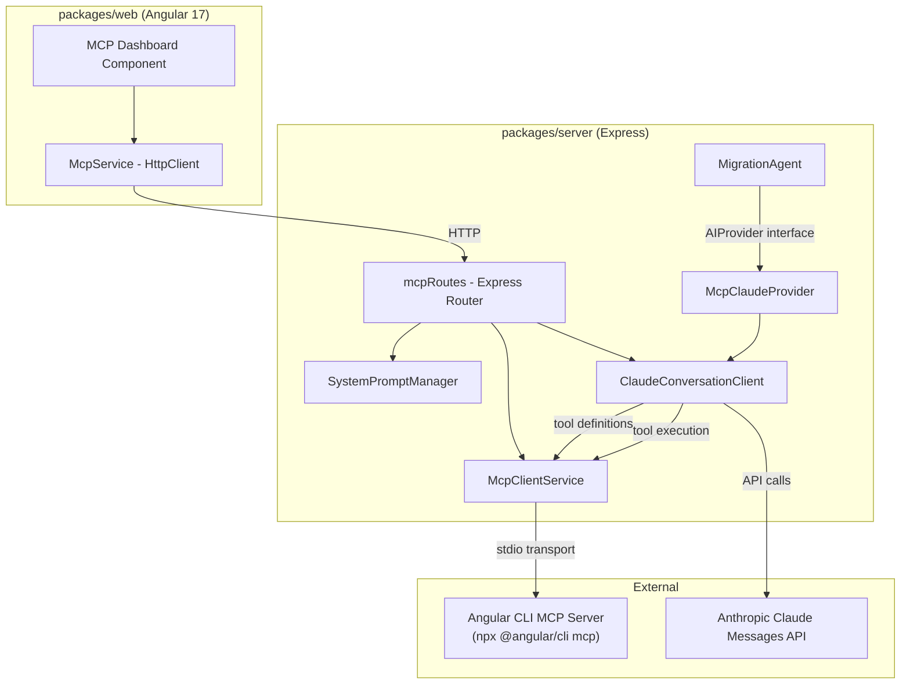
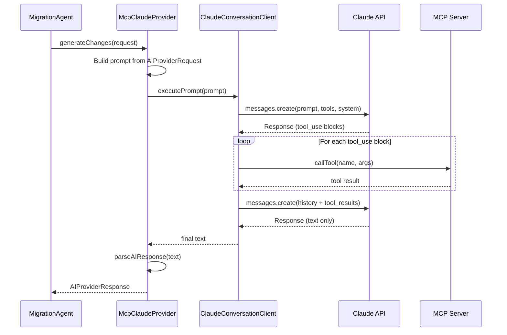
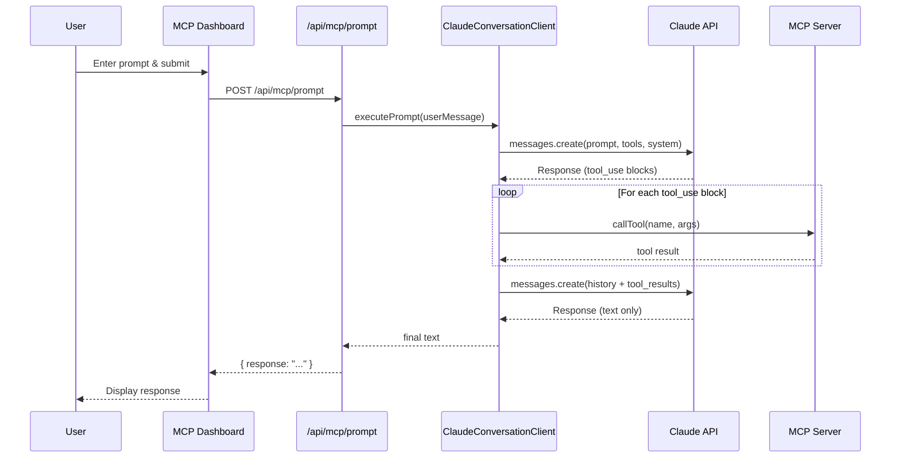

# Design Document: Claude Angular MCP Integration

## Overview

This feature adds a Claude API + Angular CLI MCP (Model Context Protocol) integration to the existing monorepo. The server spawns and manages an Angular CLI MCP server process, discovers its tools, and orchestrates a conversation loop between the Claude Messages API and the MCP server. A new `McpClaudeProvider` bridges the existing `AIProvider` interface to the conversation loop, allowing the `MigrationAgent` to leverage MCP tools during migration execution when `AI_PROVIDER_TYPE=claude-mcp`. The Angular 17 frontend provides a dashboard for controlling the MCP server lifecycle, configuring a custom system prompt, and sending ad-hoc prompts to Claude that leverage Angular CLI tooling.

The integration follows the existing architectural patterns: an Express router in `packages/server` backed by service classes, and a lazy-loaded Angular module in `packages/web` with Angular Material UI components. All Claude API authentication uses the existing `AI_PROVIDER_API_KEY` environment variable — there is no separate `ANTHROPIC_API_KEY`.

## Architecture



### Key Architectural Change: McpClaudeProvider

The `McpClaudeProvider` is a new `AIProvider` implementation that bridges the `MigrationAgent` to the `ClaudeConversationClient`. When `AI_PROVIDER_TYPE=claude-mcp`:

1. The application instantiates `McpClaudeProvider` instead of `ClaudeProvider`
2. The MCP server is auto-started during server startup
3. The `McpClientService` singleton is shared between `McpClaudeProvider` and the API routes
4. `McpClaudeProvider.generateChanges()` constructs a prompt from the `AIProviderRequest`, runs the conversation loop, and parses the final text response into an `AIProviderResponse` using the existing `parseAIResponse()` function

When MCP is not connected (e.g., server failed to start), `McpClaudeProvider` falls back to single-shot Claude API behavior without MCP tools.

### Request Flow (MigrationAgent via McpClaudeProvider)



### Request Flow (Ad-hoc Prompt via Dashboard)



## Components and Interfaces

### Server-Side Components

#### 1. McpClientService (`packages/server/src/services/McpClientService.ts`) — Existing

Manages the MCP server child process lifecycle and tool discovery. Shared singleton used by both `McpClaudeProvider` and the API routes.

- `start(): Promise<McpStartResult>` — Spawns `npx -y @angular/cli mcp` via stdio transport, connects, lists tools, populates the tool registry.
- `stop(): Promise<void>` — Kills the child process and closes the transport.
- `isConnected(): boolean` — Returns whether the MCP session is active.
- `getTools(): McpTool[]` — Returns discovered tools from the registry.
- `callTool(name: string, args: Record<string, unknown>): Promise<McpToolResult>` — Executes a tool call against the MCP server.

Internally uses the `@modelcontextprotocol/sdk` package with `StdioClientTransport`.

#### 2. SystemPromptManager (`packages/server/src/services/SystemPromptManager.ts`) — Existing

Stores and validates the custom system prompt. Stateless in-memory storage (no DB).

- `getPrompt(): string` — Returns the current system prompt (custom or default).
- `setPrompt(prompt: string): void` — Validates and stores a custom prompt.
- `resetToDefault(): void` — Clears the custom prompt, reverting to default.
- `static readonly DEFAULT_PROMPT: string` — The built-in Angular assistant prompt.
- Validation: non-empty string, max 10,000 characters.

#### 3. ClaudeConversationClient (`packages/server/src/services/ClaudeConversationClient.ts`) — Updated

Handles the Claude API conversation loop with MCP tool execution.

- `executePrompt(userMessage: string): Promise<string>` — Sends the prompt to Claude with tools and system prompt, iterates the conversation loop until a text-only response is returned.
- **Updated**: Reads API key from `AI_PROVIDER_API_KEY` (not `ANTHROPIC_API_KEY`).
- Reads model from `AI_PROVIDER_MODEL` (default `claude-sonnet-4-20250514`), max tokens from `CLAUDE_MAX_TOKENS` (default `8192`).
- Formats MCP tools as Claude tool definitions (`name`, `description`, `input_schema`).
- Includes `x-api-key` and `anthropic-version: 2023-06-01` headers.
- On tool_use blocks: calls `McpClientService.callTool()` for each, appends results to message history.
- On errors from tool calls: includes error message as tool result text, continues loop.

#### 4. McpClaudeProvider (`packages/server/src/services/McpClaudeProvider.ts`) — NEW

Bridges the `AIProvider` interface to the `ClaudeConversationClient` conversation loop, enabling the `MigrationAgent` to use MCP tools.

- Implements `AIProvider.generateChanges(request: AIProviderRequest): Promise<AIProviderResponse>`.
- Constructs a prompt from `AIProviderRequest` using the existing `buildSystemPromptText()` and `buildUserPromptText()` helpers from `AIProvider.ts`.
- Delegates to `ClaudeConversationClient.executePrompt()` for the conversation loop.
- Parses the final text response using the existing `parseAIResponse()` function from `AIProvider.ts`.
- Reads API key from `AI_PROVIDER_API_KEY`, model from `AI_PROVIDER_MODEL`.
- When MCP is not connected (`McpClientService.isConnected() === false`), falls back to single-shot Claude API behavior without MCP tools (sends the prompt directly to Claude without tool definitions).

```typescript
export class McpClaudeProvider implements AIProvider {
  constructor(
    private mcpClient: McpClientService,
    private conversationClient: ClaudeConversationClient,
  ) {}

  async generateChanges(request: AIProviderRequest): Promise<AIProviderResponse> {
    // Build prompt from request using existing helpers
    // If MCP connected: use conversationClient.executePrompt() (with tools)
    // If MCP disconnected: fall back to single-shot Claude call (no tools)
    // Parse final text with parseAIResponse()
  }
}
```

#### 5. MCP Routes (`packages/server/src/api/mcpRoutes.ts`) — Updated

Express router mounted at `/api/mcp`. **Updated**: checks `AI_PROVIDER_API_KEY` instead of `ANTHROPIC_API_KEY` for the prompt endpoint's 503 guard.

| Endpoint | Method | Description |
|---|---|---|
| `/api/mcp/start` | POST | Start MCP server, return status + tools |
| `/api/mcp/stop` | POST | Stop MCP server |
| `/api/mcp/status` | GET | Return session status + tool list |
| `/api/mcp/prompt` | POST | Execute conversation loop, return response |
| `/api/mcp/system-prompt` | GET | Get current system prompt |
| `/api/mcp/system-prompt` | PUT | Update custom system prompt |

Error responses use the existing `ApiError` type. HTTP 409 for state conflicts (start when running, prompt when disconnected). HTTP 503 when `AI_PROVIDER_API_KEY` is missing.

#### 6. Wiring in `index.ts` — Updated

The `AI_PROVIDER_TYPE` switch in `index.ts` gains a new `claude-mcp` case:

```typescript
if (aiProviderType === 'claude-mcp') {
  // Auto-start MCP server
  await mcpClient.start();
  // Create conversation client and McpClaudeProvider
  const promptManager = new SystemPromptManager();
  const conversationClient = new ClaudeConversationClient(mcpClient, promptManager);
  aiProvider = new McpClaudeProvider(mcpClient, conversationClient);
}
```

The `McpClientService` singleton is created once and shared between:
- The `McpClaudeProvider` (for MigrationAgent tool execution)
- The `createMcpRouter()` (for ad-hoc API endpoints)

#### 7. validateEnv.ts — Updated

`SUPPORTED_AI_PROVIDERS` updated from `['copilot', 'claude', 'gemini']` to `['copilot', 'claude', 'claude-mcp', 'gemini']`. The `ANTHROPIC_API_KEY` warning is removed since all Claude auth now uses `AI_PROVIDER_API_KEY`.

### Frontend Components — Existing (No Changes)

#### 8. McpModule (`packages/web/src/app/mcp/mcp.module.ts`)

Lazy-loaded Angular module. Registered in `app.routes.ts` at path `mcp`.

#### 9. McpService (`packages/web/src/app/mcp/services/mcp.service.ts`)

Angular `Injectable` service wrapping HTTP calls to `/api/mcp/*`.

#### 10. McpDashboardComponent (`packages/web/src/app/mcp/mcp-dashboard.component.ts`)

The main page component with connection status, start/stop buttons, tool list, prompt input, response display, system prompt editor, loading indicator, and error notification area.

### Design Rationale

- **McpClaudeProvider as a thin adapter**: It reuses `ClaudeConversationClient` for the conversation loop and `parseAIResponse()` for response parsing. No duplication of Claude API logic.
- **Shared McpClientService singleton**: Both the MigrationAgent (via McpClaudeProvider) and the ad-hoc API routes use the same MCP server connection, avoiding duplicate child processes.
- **Auto-start MCP on `claude-mcp`**: When the user opts into MCP-assisted migrations, the server starts the MCP server automatically so migrations can begin immediately.
- **Fallback to single-shot**: If MCP fails to start or disconnects, McpClaudeProvider degrades gracefully to single-shot behavior, ensuring migrations aren't blocked.
- **`AI_PROVIDER_API_KEY` unification**: All Claude API calls (ClaudeProvider, McpClaudeProvider, ClaudeConversationClient) use the same `AI_PROVIDER_API_KEY` env var, eliminating the need for a separate `ANTHROPIC_API_KEY`.
- **In-memory state for MCP session and system prompt**: The MCP server is a local child process tied to the Node.js server lifetime. No persistence needed.
- **Lazy-loaded Angular module**: Consistent with existing patterns. Users who don't need MCP don't pay the bundle cost.

## Data Models

### Server-Side Types (`packages/server/src/models/mcpTypes.ts`) — Existing

```typescript
export type McpSessionStatus = 'connected' | 'disconnected';

export interface McpTool {
  name: string;
  description: string;
  inputSchema: Record<string, unknown>;
}

export interface McpStartResult {
  status: McpSessionStatus;
  tools: McpTool[];
}

export interface McpToolResult {
  content: string;
  isError: boolean;
}

export interface McpStatusResponse {
  status: McpSessionStatus;
  tools: McpTool[];
}

export interface McpPromptRequest {
  prompt: string;
}

export interface McpPromptResponse {
  response: string;
}

export interface McpSystemPromptResponse {
  prompt: string;
  isDefault: boolean;
}

export interface McpSystemPromptUpdateRequest {
  prompt: string;
}
```

### Frontend Types (`packages/web/src/app/mcp/models/mcp.models.ts`) — Existing

```typescript
export type McpSessionStatus = 'connected' | 'disconnected';

export interface McpTool {
  name: string;
  description: string;
  inputSchema: Record<string, unknown>;
}

export interface McpStatusResponse {
  status: McpSessionStatus;
  tools: McpTool[];
}

export interface McpPromptResponse {
  response: string;
}

export interface McpSystemPromptResponse {
  prompt: string;
  isDefault: boolean;
}
```


## Correctness Properties

*A property is a characteristic or behavior that should hold true across all valid executions of a system — essentially, a formal statement about what the system should do. Properties serve as the bridge between human-readable specifications and machine-verifiable correctness guarantees.*

### Property 1: Tool registry preserves all tool metadata

*For any* list of MCP tools returned by the MCP server, after storing them in the Tool_Registry, every tool should be retrievable with its original name, description, and input schema intact.

**Validates: Requirements 1.4**

### Property 2: Connection status reflects lifecycle state

*For any* sequence of start and stop operations on the McpClientService, `isConnected()` should return `true` if and only if the MCP session was most recently started successfully and has not been stopped or disconnected.

**Validates: Requirements 1.7**

### Property 3: Claude request includes all required elements

*For any* user prompt, system prompt, and set of MCP tools, the HTTP request sent to the Claude Messages API should contain: the user prompt in the messages array, the system prompt in the system field, all tools formatted as Claude tool definitions, the `x-api-key` header with the configured API key (from `AI_PROVIDER_API_KEY`), and the `anthropic-version: 2023-06-01` header.

**Validates: Requirements 2.2, 2.3, 3.1, 3.5**

### Property 4: Conversation loop executes all tool-use blocks and feeds results back

*For any* Claude API response containing N tool-use content blocks, the conversation loop should execute exactly N tool calls against the MCP server, and the subsequent follow-up request to Claude should contain exactly N tool result entries in the message history. If any tool call fails, the error message should be included as the tool result and the loop should continue.

**Validates: Requirements 2.4, 3.2, 3.3, 3.7**

### Property 5: Text-only response terminates conversation loop

*For any* Claude API response that contains only text content blocks and no tool-use blocks, the conversation loop should terminate and return the concatenated text content without making additional API calls.

**Validates: Requirements 3.4**

### Property 6: HTTP errors produce descriptive error responses

*For any* HTTP error status code (4xx or 5xx) returned by the Claude API with an error body, the ClaudeConversationClient should return an error containing both the status code and the error message from the response body.

**Validates: Requirements 3.6**

### Property 7: System prompt validation

*For any* string, the SystemPromptManager should accept it as a valid custom prompt if and only if it is non-empty (after trimming) and has a length of at most 10,000 characters. All other strings should be rejected.

**Validates: Requirements 5.2**

### Property 8: System prompt selection round-trip

*For any* state of the SystemPromptManager, the prompt returned by `getPrompt()` should equal the most recently stored valid custom prompt if one exists, or the default prompt otherwise. Setting then getting should round-trip the custom prompt value.

**Validates: Requirements 5.3, 5.4**

### Property 9: Environment configuration resolution with defaults

*For any* combination of `AI_PROVIDER_MODEL` and `CLAUDE_MAX_TOKENS` environment variable values (present or absent), the ClaudeConversationClient should use the provided value when set, or the default (`claude-sonnet-4-20250514` for model, `8192` for max_tokens) when not set. The resolved values should appear in the Claude API request body.

**Validates: Requirements 4.5, 9.2, 9.3**

### Property 10: McpClaudeProvider response parsing

*For any* valid JSON string containing `fileChanges`, `prDescription`, and `errors` fields, `parseAIResponse()` should produce an `AIProviderResponse` where the file changes, PR description, and errors match the input JSON. Serializing a valid `AIProviderResponse` to JSON and parsing it back should round-trip.

**Validates: Requirements 2.5**

### Property 11: McpClaudeProvider fallback without MCP

*For any* `AIProviderRequest`, when the MCP session is not active (`isConnected() === false`), `McpClaudeProvider.generateChanges()` should still produce a valid `AIProviderResponse` by falling back to single-shot Claude API behavior without including MCP tool definitions.

**Validates: Requirements 2.7**

## Error Handling

### Server-Side Errors

| Error Condition | HTTP Status | Error Code | Behavior |
|---|---|---|---|
| `AI_PROVIDER_API_KEY` not set | 503 | `MCP_API_KEY_MISSING` | All `/api/mcp/prompt` calls rejected |
| Start when already running | 409 | `MCP_ALREADY_RUNNING` | Return current status |
| Prompt when disconnected | 409 | `MCP_NOT_CONNECTED` | Instruct user to start MCP server |
| `npx` not on PATH | 500 | `MCP_NPX_NOT_FOUND` | Return descriptive error |
| MCP server start timeout (30s) | 500 | `MCP_START_TIMEOUT` | Kill process, return error |
| Claude API HTTP error | 502 | `CLAUDE_API_ERROR` | Forward status code and message |
| Tool call failure | N/A | N/A | Error included as tool result, loop continues |
| System prompt validation failure | 400 | `VALIDATION_ERROR` | Return validation message |
| MCP disconnected during migration | N/A | N/A | McpClaudeProvider falls back to single-shot |

### Frontend Error Handling

- All API errors are caught in `McpService` subscribers and displayed in the error notification area of the MCP Dashboard.
- Network errors and timeouts surface as user-friendly messages.
- The UI remains functional after errors — users can retry operations.

## Testing Strategy

### Unit Tests

Unit tests cover specific examples, edge cases, and integration points:

- **McpClientService**: Mock `child_process.spawn` and MCP SDK. Test start/stop lifecycle, tool discovery, unexpected process exit handling, npx validation, and 30-second timeout.
- **SystemPromptManager**: Test default prompt retrieval, custom prompt storage, validation edge cases (empty string, whitespace-only, exactly 10,000 chars, 10,001 chars), reset to default.
- **ClaudeConversationClient**: Mock fetch. Test single-turn text response, multi-turn tool-use loop, Claude API error handling, tool call failure resilience, missing API key (`AI_PROVIDER_API_KEY`).
- **McpClaudeProvider**: Mock `ClaudeConversationClient` and `McpClientService`. Test `generateChanges()` with MCP connected (conversation loop path), MCP disconnected (single-shot fallback), response parsing via `parseAIResponse()`.
- **mcpRoutes**: Supertest-style route tests for each endpoint, including 409 conflict cases, 503 missing `AI_PROVIDER_API_KEY`.
- **validateEnv**: Test that `claude-mcp` is accepted as a valid `AI_PROVIDER_TYPE`.
- **McpDashboardComponent**: Angular TestBed tests for component rendering, button state based on connection status, loading indicator during prompt execution, error display.

### Property-Based Tests

Property-based tests use `fast-check` with Vitest on the server. Each property test runs a minimum of 100 iterations.

Each property test is tagged with a comment referencing the design property:

```
// Feature: claude-angular-mcp-integration, Property N: <property text>
```

Properties to implement:

1. **Property 1** — Generate random arrays of `McpTool` objects, store them, verify all are retrievable with matching fields.
2. **Property 2** — Generate random sequences of start/stop operations, verify `isConnected()` matches expected state after each.
3. **Property 3** — Generate random prompts, system prompts, and tool sets. Mock fetch, capture the request, verify all elements present including `AI_PROVIDER_API_KEY` in the `x-api-key` header.
4. **Property 4** — Generate Claude responses with random numbers of tool-use blocks. Mock MCP tool execution (including failures). Verify the follow-up request contains matching tool results.
5. **Property 5** — Generate Claude responses with only text blocks. Verify the loop returns the text and makes no further API calls.
6. **Property 6** — Generate random HTTP error status codes and error bodies. Verify the returned error contains both.
7. **Property 7** — Generate random strings (including empty, whitespace, boundary lengths). Verify validation accepts/rejects correctly.
8. **Property 8** — Generate random valid prompts. Set then get, verify round-trip. Reset, verify default returned.
9. **Property 9** — Generate random env var combinations (present/absent, various values). Verify resolved config matches expected values with defaults.
10. **Property 10** — Generate random valid `AIProviderResponse` objects, serialize to JSON, wrap in markdown code block, parse with `parseAIResponse()`, verify round-trip.
11. **Property 11** — Generate random `AIProviderRequest` objects with MCP disconnected. Verify `McpClaudeProvider.generateChanges()` produces a valid `AIProviderResponse` without tool definitions in the Claude request.
