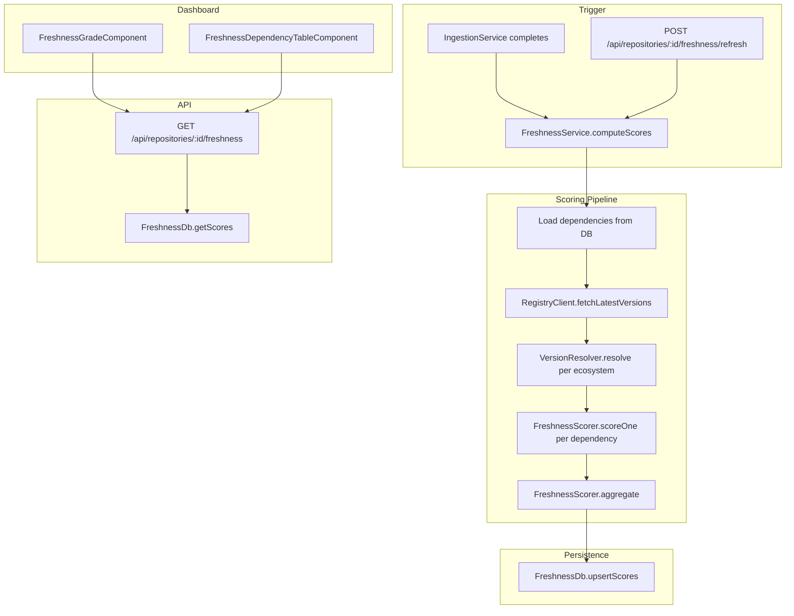

# Design Document: Dependency Freshness Scoring

## Overview

This feature adds dependency freshness scoring to the Repository Metadata Dashboard. After ingestion, the system fetches the latest version of each dependency from its package registry, resolves the declared version constraint to a concrete version, computes a per-dependency freshness score (0–100), and aggregates those scores into a repository-level letter grade (A–E). Scores are persisted in PostgreSQL, exposed via REST API, and displayed in the Angular dashboard.

The design integrates into the existing architecture: the `IngestionService` pipeline triggers scoring, new database tables store results, new API routes serve them, and a new dashboard component renders them.

## Architecture



The pipeline is composed of four pure-logic modules (`RegistryClient`, `VersionResolver`, `FreshnessScorer`, `FreshnessDb`) orchestrated by `FreshnessService`. This keeps each concern independently testable.

## Components and Interfaces

### 1. RegistryClient

Fetches the latest stable version for a dependency from its ecosystem's public registry. One method per registry is unnecessary; instead, a single `fetchLatest(ecosystem, packageName)` dispatches to the correct registry URL internally.

**Supported registries:**
| Ecosystem | Registry API |
|-----------|-------------|
| npm | `https://registry.npmjs.org/{pkg}` |
| pypi | `https://pypi.org/pypi/{pkg}/json` |
| cargo | `https://crates.io/api/v1/crates/{pkg}` |
| maven | `https://search.maven.org/solrsearch/select?q=g:{group}+AND+a:{artifact}` |
| rubygems | `https://rubygems.org/api/v1/gems/{pkg}.json` |
| go | `https://proxy.golang.org/{pkg}/@latest` |

```typescript
interface RegistryClientOptions {
  concurrencyLimit: number;  // default: 5
  cacheTtlMs: number;        // default: 3600000 (1 hour)
}

interface RegistryLookupResult {
  ecosystem: string;
  packageName: string;
  latestVersion: string | null;  // null if not found
  error?: string;                // set if registry returned an error
}

class RegistryClient {
  constructor(options?: Partial<RegistryClientOptions>);
  fetchLatest(ecosystem: string, packageName: string): Promise<RegistryLookupResult>;
  fetchMany(deps: Array<{ ecosystem: string; name: string }>): Promise<RegistryLookupResult[]>;
  clearCache(): void;
}
```

- Uses an in-memory Map as cache, keyed by `ecosystem::packageName`, with TTL expiry.
- `fetchMany` uses a concurrency-limited pool (e.g., `p-limit`) to avoid overwhelming registries.
- On HTTP error or timeout, records the error string and returns `latestVersion: null`.
- If a package is not found (404), sets `latestVersion: null` with no error (dependency marked "unresolved").

### 2. VersionResolver

Extracts a concrete minimum version from a version constraint string. This is a pure function per ecosystem.

```typescript
interface ResolvedVersion {
  major: number;
  minor: number;
  patch: number;
  prerelease?: string;
}

interface VersionResolveResult {
  resolved: ResolvedVersion | null;
  unpinned: boolean;   // true if constraint was empty/absent
  warning?: string;    // set if constraint could not be parsed
}

function resolveVersion(ecosystem: string, constraint: string | undefined): VersionResolveResult;
```

**Resolution rules by ecosystem:**
- **npm**: Parse semver range, extract minimum satisfying version. `^1.2.3` → `1.2.3`, `~1.2.3` → `1.2.3`, `>=1.0.0 <2.0.0` → `1.0.0`.
- **pypi**: Parse PEP 440. `~=3.4` → `3.4.0`, `>=1.0,<2.0` → `1.0.0`.
- **cargo**: Same as npm semver semantics.
- **maven**: Parse Maven version ranges. `[1.2,2.0)` → `1.2.0`. Plain `1.2.3` → `1.2.3`.
- **rubygems**: `~> 1.2` → `1.2.0`, `>= 1.0, < 2.0` → `1.0.0`.
- **go**: Strip `v` prefix, parse semver. `v1.2.3` → `1.2.3`. Pseudo-versions extract the base version.

If the constraint is empty/undefined, returns `{ resolved: null, unpinned: true }`.
If the constraint cannot be parsed, returns `{ resolved: null, warning: "..." }`.

### 3. FreshnessScorer

Pure functions that compute individual scores and aggregate them.

```typescript
function scoreOne(resolved: ResolvedVersion, latest: ResolvedVersion): number;
function aggregate(scores: Array<{ score: number; dependencyType: 'production' | 'development' }>): { weightedAverage: number; grade: RepositoryGrade };
function mapScoreToGrade(score: number): RepositoryGrade;

type RepositoryGrade = 'A' | 'B' | 'C' | 'D' | 'E';
```

**`scoreOne` algorithm:**
1. Compute `majorDiff = latest.major - resolved.major`, `minorDiff = latest.minor - resolved.minor`, `patchDiff = latest.patch - resolved.patch`.
2. If all diffs are 0 and resolved has no prerelease (or both have same prerelease): score = 100.
3. If resolved has a prerelease tag and latest does not (same major.minor.patch): score = 90.
4. If `majorDiff >= 4`: score = 0.
5. Otherwise: `score = max(0, 100 - (majorDiff * 30) - (max(0, minorDiff) * 5) - (max(0, patchDiff) * 1))`.
6. Clamp to [0, 100].

**`aggregate` algorithm:**
1. Production dependencies get weight 2, development dependencies get weight 1.
2. Weighted average = sum(score × weight) / sum(weight).
3. If no dependencies: score = 100, grade = A.

**Grade thresholds:** A: 90–100, B: 70–89, C: 50–69, D: 30–49, E: 0–29.

### 4. FreshnessService

Orchestrates the full scoring pipeline.

```typescript
class FreshnessService {
  constructor(db: RepositoryDb, registryClient: RegistryClient);

  /** Full scoring pipeline: fetch latest versions, resolve, score, persist. */
  computeScores(repositoryId: string, ingestionId?: string): Promise<void>;

  /** Check if scoring is in progress for a repository. */
  isScoring(repositoryId: string): boolean;
}
```

- Maintains an in-memory `Set<string>` of repository IDs currently being scored, to detect conflicts (Req 8.3).
- `computeScores` flow:
  1. Add repositoryId to in-progress set.
  2. Load dependencies from `RepositoryDb.getRepositoryDependencies(repositoryId)`.
  3. Call `RegistryClient.fetchMany(...)` for all dependencies.
  4. For each dependency, call `resolveVersion(...)` and `scoreOne(...)`.
  5. Call `aggregate(...)` to get weighted average and grade.
  6. Persist via `FreshnessDb.upsertScores(...)`.
  7. Remove repositoryId from in-progress set (in finally block).

### 5. FreshnessDb (extension to RepositoryDb)

New methods on the existing `RepositoryDb` class.

```typescript
// Added to RepositoryDb
async upsertFreshnessScores(repositoryId: string, ingestionId: string | null, result: FreshnessResult): Promise<void>;
async getFreshnessScores(repositoryId: string): Promise<FreshnessResult | null>;
```

### 6. REST API Routes

New route file: `packages/server/src/api/freshnessRoutes.ts`

```typescript
function createFreshnessRouter(db: RepositoryDb, freshnessService: FreshnessService): Router;
```

**Endpoints:**
- `GET /api/repositories/:id/freshness?ecosystem=<optional>` — Returns freshness result.
- `POST /api/repositories/:id/freshness/refresh` — Triggers re-computation.

### 7. Dashboard Components

New Angular components in `packages/web/src/app/dashboard/components/`:

- **`freshness-grade/`**: Displays the letter grade with color indicator and numeric percentage.
- **`freshness-table/`**: Material table of per-dependency scores with sorting and ecosystem filter dropdown.

New service method in `RepositoryService`:
```typescript
getFreshness(repositoryId: string, ecosystem?: string): Observable<FreshnessResponse>;
refreshFreshness(repositoryId: string): Observable<void>;
```

## Data Models

### New TypeScript Types

```typescript
// Added to packages/server/src/models/types.ts

type RepositoryGrade = 'A' | 'B' | 'C' | 'D' | 'E';

interface DependencyFreshnessScore {
  dependencyName: string;
  ecosystem: string;
  resolvedVersion: string | null;
  latestVersion: string | null;
  score: number | null;          // null if unresolved/unparseable
  dependencyType: 'production' | 'development';
  status: 'scored' | 'unresolved' | 'unpinned' | 'error';
  error?: string;
}

interface FreshnessResult {
  repositoryId: string;
  ingestionId: string | null;
  grade: RepositoryGrade;
  weightedAverage: number;
  computedAt: Date;
  dependencies: DependencyFreshnessScore[];
}
```

### New Database Tables

**Migration: `002_freshness_scores.sql`**

```sql
-- Repository-level freshness summary
CREATE TABLE repository_freshness (
    id UUID PRIMARY KEY DEFAULT gen_random_uuid(),
    repository_id UUID NOT NULL REFERENCES repositories(id),
    ingestion_id UUID REFERENCES ingestions(id),
    grade VARCHAR(1) NOT NULL CHECK (grade IN ('A', 'B', 'C', 'D', 'E')),
    weighted_average NUMERIC(5, 2) NOT NULL,
    computed_at TIMESTAMPTZ NOT NULL DEFAULT NOW(),
    UNIQUE (repository_id)
);

-- Per-dependency freshness scores
CREATE TABLE dependency_freshness_scores (
    id UUID PRIMARY KEY DEFAULT gen_random_uuid(),
    freshness_id UUID NOT NULL REFERENCES repository_freshness(id) ON DELETE CASCADE,
    dependency_name VARCHAR(255) NOT NULL,
    ecosystem VARCHAR(50) NOT NULL,
    resolved_version VARCHAR(100),
    latest_version VARCHAR(100),
    score INTEGER CHECK (score IS NULL OR (score >= 0 AND score <= 100)),
    dependency_type VARCHAR(20) NOT NULL CHECK (dependency_type IN ('production', 'development')),
    status VARCHAR(20) NOT NULL CHECK (status IN ('scored', 'unresolved', 'unpinned', 'error')),
    error_details TEXT
);

CREATE INDEX idx_dep_freshness_freshness_id ON dependency_freshness_scores(freshness_id);
CREATE INDEX idx_repo_freshness_repo_id ON repository_freshness(repository_id);
```

The `UNIQUE (repository_id)` constraint on `repository_freshness` ensures only the latest scores are kept per repository (upsert replaces old scores). The `ON DELETE CASCADE` on `dependency_freshness_scores` ensures child rows are cleaned up when the parent is replaced.

### API Response Shape

`GET /api/repositories/:id/freshness`:
```json
{
  "repositoryId": "uuid",
  "ingestionId": "uuid",
  "grade": "B",
  "weightedAverage": 74.5,
  "computedAt": "2024-01-15T10:30:00Z",
  "dependencies": [
    {
      "dependencyName": "express",
      "ecosystem": "npm",
      "resolvedVersion": "4.18.2",
      "latestVersion": "4.21.0",
      "score": 85,
      "dependencyType": "production",
      "status": "scored"
    }
  ]
}
```
