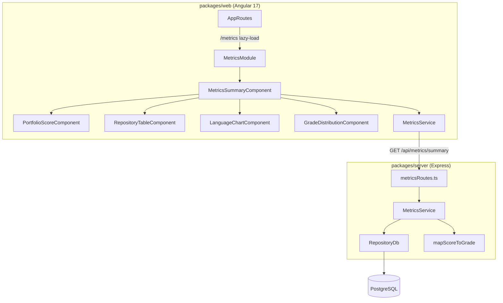

# Design Document: Metrics Summary Dashboard

## Overview

The Metrics Summary Dashboard adds a portfolio-level view to the Repository Metadata Dashboard. It introduces:

1. A new backend endpoint (`GET /api/metrics/summary`) that aggregates freshness scores, dependency counts, and language distributions across all repositories into a single response.
2. A new Angular lazy-loaded module at `/metrics` that renders the aggregated data as a portfolio score card, repository summary table, language distribution chart, and grade distribution breakdown.

The design reuses the existing `RepositoryDb` data access layer, `FreshnessScorer.mapScoreToGrade` grading scale, and the Angular Material + ngx-charts libraries already in the project.

## Architecture



### Data Flow

1. User navigates to `/metrics`.
2. `MetricsSummaryComponent` calls `MetricsService.getSummary()`.
3. `MetricsService` issues `GET /api/metrics/summary`.
4. `metricsRoutes` handler calls `MetricsService.computeSummary()` on the server.
5. Server `MetricsService` queries `RepositoryDb` for all repositories, their freshness scores, dependencies, and languages.
6. It computes the portfolio score (weighted average of repo scores, weighted by scored dependency count), derives the portfolio grade, aggregates language distributions, and assembles the response.
7. The frontend renders the response across four sub-components.

## Components and Interfaces

### Backend

#### `GET /api/metrics/summary` — metricsRoutes.ts

New Express router factory `createMetricsRouter(db: RepositoryDb)` mounted at `/api/metrics`.

**Response shape** (`MetricsSummaryResponse`):

```typescript
interface MetricsSummaryResponse {
  totalRepositories: number;
  portfolioScore: number;       // 0–100
  portfolioGrade: RepositoryGrade; // 'A'|'B'|'C'|'D'|'E'
  repositories: RepositorySummary[];
  languageDistribution: LanguageDistributionEntry[];
}

interface RepositorySummary {
  id: string;
  name: string;
  sourceType: 'local' | 'github' | 'azure_devops';
  freshnessGrade: RepositoryGrade | null;
  freshnessScore: number | null;
  freshnessStatus: 'scored' | 'pending';
  totalDependencies: number;
  productionDependencies: number;
  developmentDependencies: number;
  primaryLanguage: string | null;
  lastIngestionDate: string | null;
}

interface LanguageDistributionEntry {
  language: string;
  totalFileCount: number;
  proportion: number;           // 0–1
}
```

#### Server-side `MetricsService` — services/MetricsService.ts

Pure computation class with a single public method:

```typescript
class MetricsService {
  constructor(private readonly db: RepositoryDb) {}
  async computeSummary(): Promise<MetricsSummaryResponse>;
}
```

Internally:
1. `db.listRepositories()` → all repos.
2. For each repo, fetch freshness scores (`db.getFreshnessScores`), dependencies (`db.getRepositoryDependencies`), languages (`db.getRepositoryLanguages`), and latest ingestion (`db.getLatestIngestion`).
3. Build `RepositorySummary[]` — repos without freshness scores get `freshnessStatus: 'pending'`.
4. Compute portfolio score: weighted average of each repo's `weightedAverage`, where weight = number of scored dependencies in that repo. If total weight is 0, portfolio score = 100.
5. Derive portfolio grade via `mapScoreToGrade`.
6. Aggregate language distribution: sum `fileCount` per language across all repos, compute proportions.

#### Portfolio Score Algorithm (pure function)

```typescript
function computePortfolioScore(
  repos: Array<{ weightedAverage: number; scoredDependencyCount: number }>
): number;
```

- Sum of `(repo.weightedAverage * repo.scoredDependencyCount)` / sum of `repo.scoredDependencyCount`.
- If denominator is 0, return 100.

This will be extracted as a standalone pure function for testability.

#### Language Aggregation (pure function)

```typescript
function aggregateLanguages(
  repoLanguages: RepositoryLanguage[][]
): LanguageDistributionEntry[];
```

- Flatten all language arrays, sum `fileCount` per language.
- Compute `proportion = languageFileCount / totalFileCount`.
- Sort descending by `totalFileCount`.

### Frontend

#### MetricsModule (`packages/web/src/app/metrics/metrics.module.ts`)

Lazy-loaded Angular module with its own route (`path: ''` → `MetricsSummaryComponent`).

#### MetricsService (`packages/web/src/app/metrics/services/metrics.service.ts`)

```typescript
@Injectable()
class MetricsService {
  getSummary(): Observable<MetricsSummaryResponse>;
}
```

#### MetricsSummaryComponent

Container component that:
- Calls `MetricsService.getSummary()` on init.
- Manages loading/error/empty states.
- Passes data to child components.
- Provides "Repository Dashboard" back-navigation link.

#### PortfolioScoreComponent

Displays the portfolio grade (large color-coded letter), numeric score (1 decimal), and total repository count.

**Color mapping** (reused from existing `freshness-grade` component):
- A = green (#4caf50), B = blue (#2196f3), C = yellow (#ff9800), D = orange (#f57c00), E = red (#f44336)

#### RepositoryTableComponent

Material table with columns: name, source type, grade (color-coded), score, total deps, primary language, last ingestion date. Default sort: score ascending. Row click navigates to `/?repo={id}`.

#### LanguageChartComponent

ngx-charts pie or bar chart showing aggregated language distribution. Falls back to "No language data available" message.

#### GradeDistributionComponent

Displays count of repos per grade (A–E + Pending), color-coded. Shows 0 for empty categories.

## Data Models

### New Backend Types (`packages/server/src/models/types.ts`)

```typescript
// Metrics Summary
export interface MetricsSummaryResponse {
  totalRepositories: number;
  portfolioScore: number;
  portfolioGrade: RepositoryGrade;
  repositories: RepositorySummary[];
  languageDistribution: LanguageDistributionEntry[];
}

export interface RepositorySummary {
  id: string;
  name: string;
  sourceType: 'local' | 'github' | 'azure_devops';
  freshnessGrade: RepositoryGrade | null;
  freshnessScore: number | null;
  freshnessStatus: 'scored' | 'pending';
  totalDependencies: number;
  productionDependencies: number;
  developmentDependencies: number;
  primaryLanguage: string | null;
  lastIngestionDate: string | null;
}

export interface LanguageDistributionEntry {
  language: string;
  totalFileCount: number;
  proportion: number;
}
```

### New Frontend Models (`packages/web/src/app/metrics/models/metrics.models.ts`)

Mirror of the backend types for the Angular side, using the existing `RepositoryGrade` type.

### Existing Types Reused (no changes)

- `RepositoryGrade` — `'A' | 'B' | 'C' | 'D' | 'E'`
- `Repository`, `RepositoryLanguage`, `FreshnessResult`, `RepositoryDependency` — queried by `MetricsService`
- `mapScoreToGrade` from `FreshnessScorer` — reused for portfolio grade derivation


## Correctness Properties

*A property is a characteristic or behavior that should hold true across all valid executions of a system — essentially, a formal statement about what the system should do. Properties serve as the bridge between human-readable specifications and machine-verifiable correctness guarantees.*

### Property 1: Summary response completeness

*For any* set of repositories in the database (with any combination of freshness scores, dependencies, and languages), the `GET /api/metrics/summary` response SHALL contain `totalRepositories`, `portfolioScore`, `portfolioGrade`, `repositories` array, and `languageDistribution` array at the top level, and each entry in the `repositories` array SHALL contain `id`, `name`, `sourceType`, `freshnessGrade`, `freshnessScore`, `freshnessStatus`, `totalDependencies`, `productionDependencies`, `developmentDependencies`, `primaryLanguage`, and `lastIngestionDate`.

**Validates: Requirements 1.1, 1.4**

### Property 2: Portfolio score is weighted average by scored dependency count

*For any* set of repositories where at least one has scored dependencies, the `portfolioScore` SHALL equal the weighted average of each repository's `freshnessScore`, where each repository's weight is its number of scored dependencies. Formally: `portfolioScore = Σ(repo.freshnessScore × repo.scoredDeps) / Σ(repo.scoredDeps)`. The `portfolioGrade` SHALL equal `mapScoreToGrade(portfolioScore)` using the scale A (90–100), B (70–89), C (50–69), D (30–49), E (0–29).

**Validates: Requirements 2.1, 2.3**

### Property 3: Unscored repositories excluded from portfolio score and marked pending

*For any* mix of repositories where some have freshness scores and some do not, the `portfolioScore` SHALL be computed using only the repositories that have freshness scores. Every repository without freshness scores SHALL appear in the `repositories` array with `freshnessStatus` equal to `"pending"` and `freshnessGrade` and `freshnessScore` both null.

**Validates: Requirements 1.3**

### Property 4: Language aggregation preserves total file counts

*For any* set of repositories with language data, the `languageDistribution` SHALL contain one entry per unique language across all repositories, where `totalFileCount` equals the sum of that language's `fileCount` across all repositories. The `proportion` values SHALL sum to 1 (within floating-point tolerance), and each `proportion` SHALL equal `totalFileCount / grandTotalFileCount`.

**Validates: Requirements 1.5**

### Property 5: Grade color mapping consistency

*For any* grade value in {A, B, C, D, E}, the color applied SHALL be: A → green (#4caf50), B → blue (#2196f3), C → yellow (#ff9800), D → orange (#f57c00), E → red (#f44336). This mapping SHALL be consistent across the portfolio score display, the repository table grade column, and the grade distribution breakdown.

**Validates: Requirements 4.1, 5.2, 7.2**

### Property 6: Score display formatting

*For any* portfolio score in the range [0, 100], the displayed numeric value SHALL be the score rounded to exactly one decimal place.

**Validates: Requirements 4.2**

### Property 7: Pending repositories display "Pending"

*For any* repository in the summary with `freshnessStatus` equal to `"pending"`, the repository table SHALL display the text "Pending" in both the grade and score columns for that row.

**Validates: Requirements 5.3**

### Property 8: Default table sort is ascending by freshness score

*For any* set of repositories displayed in the summary table, the default ordering SHALL be ascending by `freshnessScore`, such that for every adjacent pair of rows (i, i+1), `row[i].freshnessScore <= row[i+1].freshnessScore` (with null/pending scores sorted to the top).

**Validates: Requirements 5.5**

### Property 9: Language chart shows name and proportion

*For any* non-empty language distribution, each entry rendered in the chart SHALL include the language name and its proportion expressed as a percentage of total files.

**Validates: Requirements 6.2**

### Property 10: Grade distribution counts all categories

*For any* set of repository summaries, the grade distribution SHALL contain exactly 6 categories (A, B, C, D, E, Pending), and the count for each category SHALL equal the number of repositories with that grade (or `freshnessStatus: 'pending'` for the Pending category). The sum of all category counts SHALL equal `totalRepositories`.

**Validates: Requirements 7.1**

## Error Handling

### Backend

| Scenario | HTTP Status | Error Code | Message |
|---|---|---|---|
| Database query failure | 500 | `INTERNAL_ERROR` | Descriptive error message from the caught exception |
| Unexpected exception | 500 | `INTERNAL_ERROR` | Generic fallback message |

The `metricsRoutes` handler wraps all logic in a try/catch, consistent with existing route handlers (`freshnessRoutes`, `repositoryRoutes`). The `ApiError` interface is reused.

No repositories is not an error — it returns a valid response with `totalRepositories: 0`, `portfolioScore: 100`, `portfolioGrade: 'A'`, and empty arrays.

### Frontend

| Scenario | Behavior |
|---|---|
| API request fails (network/500) | Display "Failed to load metrics summary. Please try again." with a retry button |
| Retry button clicked | Re-issue `GET /api/metrics/summary` |
| API returns empty repository list | Display "No repositories found. Ingest a repository to get started." with link to `/` |
| API returns no language data | Display "No language data available" in place of chart |
| Loading state | Show `mat-progress-spinner` in place of portfolio score section |

## Testing Strategy

### Property-Based Testing

The project already has `fast-check` (v3.19.0) installed in both `packages/server` and `packages/web`. All property-based tests will use `fast-check` with a minimum of 100 iterations per property.

Each property test must be tagged with a comment referencing the design property:
```
// Feature: metrics-summary-dashboard, Property N: <property title>
```

Each correctness property above maps to a single property-based test.

**Backend property tests** (`packages/server`):
- Property 1 (response completeness): Generate random sets of repo/freshness/language data, call `computeSummary`, verify all fields present.
- Property 2 (portfolio score computation): Generate random `{weightedAverage, scoredDependencyCount}` arrays, call `computePortfolioScore`, verify weighted average math and grade derivation.
- Property 3 (unscored repos excluded): Generate mixed scored/unscored repo sets, verify only scored repos contribute to portfolio score and unscored are marked pending.
- Property 4 (language aggregation): Generate random `RepositoryLanguage[][]`, call `aggregateLanguages`, verify sums and proportions.
- Property 10 (grade distribution): Generate random repo summaries with various grades, compute distribution, verify counts sum to total.

**Frontend property tests** (`packages/web`):
- Property 5 (grade color mapping): Generate random grades, verify color output matches spec.
- Property 6 (score formatting): Generate random scores in [0, 100], verify formatting to 1 decimal place.
- Property 7 (pending display): Generate repo summaries with pending status, verify "Pending" text rendering.
- Property 8 (table sort): Generate random repo summary arrays, verify default sort is ascending by score.
- Property 9 (language chart rendering): Generate random language distributions, verify name and percentage presence.

### Unit Tests (Examples and Edge Cases)

**Backend unit tests:**
- Empty database returns `{ totalRepositories: 0, portfolioScore: 100, portfolioGrade: 'A', repositories: [], languageDistribution: [] }` (edge case from 1.2, 2.2)
- Database error returns 500 with `INTERNAL_ERROR` (example from 1.6)
- All repos with zero scored dependencies returns portfolio score 100 (edge case from 2.2)
- No language data returns empty `languageDistribution` (edge case from 6.3)

**Frontend unit tests:**
- "Metrics Overview" link exists in dashboard header and navigates to `/metrics` (examples from 3.1, 3.2)
- "Repository Dashboard" link exists in metrics page and navigates to `/` (examples from 3.3)
- Route `/metrics` lazy-loads MetricsModule (example from 3.4)
- Total repository count displayed alongside portfolio score (example from 4.3)
- Loading spinner shown while data is loading (example from 4.4)
- Repository row click navigates to `/?repo={id}` (example from 5.4)
- Language chart renders when data is present (example from 6.1)
- "No language data available" shown when language distribution is empty (edge case from 6.3)
- Error message and retry button shown on API failure (example from 8.1)
- Retry button triggers new API request (example from 8.2)
- Empty state message shown when no repositories exist (example from 8.3)
- Grade categories with zero repos show count of 0 (edge case from 7.3)
