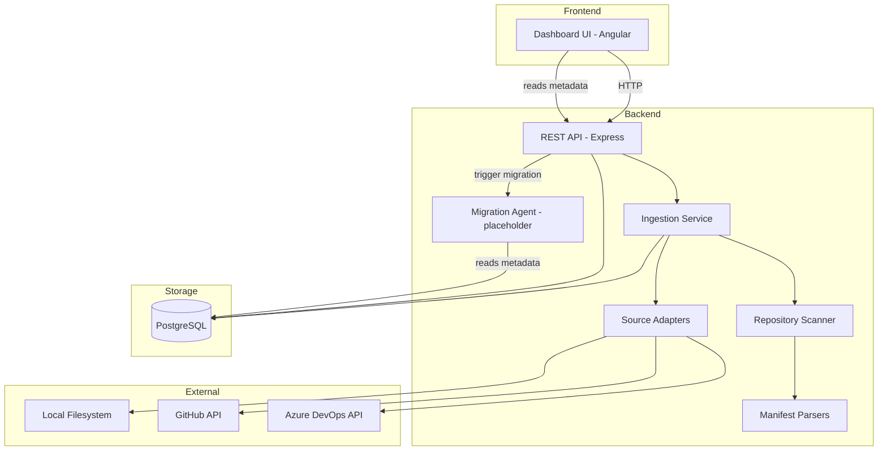
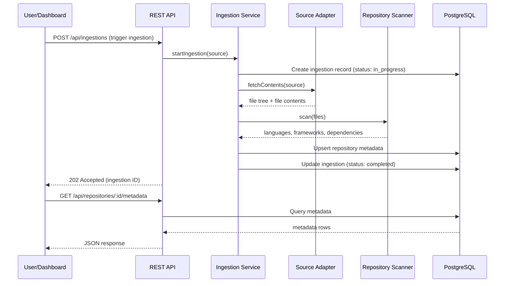
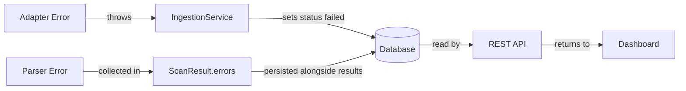

# Design Document: Repository Metadata Dashboard

## Overview

The Repository Metadata Dashboard is a full-stack application that ingests repository contents from multiple sources (local filesystem, GitHub API, Azure DevOps API), extracts technology metadata (languages, frameworks, versions, dependencies), persists it in PostgreSQL with JSONB, and presents it through a web dashboard. The architecture is designed for a future phase where a background agent performs bulk migration queries across many repositories.

The system follows an ingestion pipeline pattern:

```
Repository Source → Ingestion Service → Scanner → Database → Dashboard
```

### Key Design Decisions

1. **TypeScript + Node.js backend**: Chosen for strong JSON/JSONB handling, rich ecosystem of parsers (TOML, XML, YAML), and shared language with the frontend.
2. **PostgreSQL with JSONB**: Structured tables for core entities, JSONB columns for flexible/variable metadata that differs across repository types.
3. **Angular frontend**: Component-based dashboard using Angular services for data fetching and components for presentation, with Angular modules for feature organization.
4. **Parser-per-format strategy**: Each manifest file format gets a dedicated parser implementing a common interface, making it easy to add new formats.
5. **Source adapter pattern**: Each repository source (local, GitHub, Azure DevOps) implements a common adapter interface, isolating API-specific logic.

## Architecture



### Request Flow



## Components and Interfaces

### Source Adapters

Each source adapter implements a common interface for fetching repository contents.

```typescript
interface FileEntry {
  path: string;
  type: 'file' | 'directory';
  size?: number;
}

interface FileContent {
  path: string;
  content: string;
}

interface FetchResult {
  fileTree: FileEntry[];
  files: FileContent[];  // Only manifest/config files needed for scanning
}

interface SourceAdapter {
  /** Fetch file tree and relevant file contents from the repository source */
  fetch(source: RepositorySource): Promise<FetchResult>;
}
```

Three implementations:
- **LocalFilesystemAdapter**: Reads files directly from disk using `fs` APIs. Walks the directory tree, filters for manifest/config files.
- **GitHubAdapter**: Uses GitHub REST API (`GET /repos/{owner}/{repo}/git/trees/{sha}?recursive=1` for tree, `GET /repos/{owner}/{repo}/contents/{path}` for file contents). Authenticates via `Authorization: Bearer {token}`. Handles rate limiting via `X-RateLimit-*` headers.
- **AzureDevOpsAdapter**: Uses Azure DevOps REST API (`GET {org}/{project}/_apis/git/repositories/{repo}/items?recursionLevel=Full` for tree, `GET ...items?path={path}` for file contents). Authenticates via `Authorization: Basic {base64(":"+token)}`.

### Repository Scanner

The scanner analyzes fetched files to extract metadata.

```typescript
interface Technology {
  name: string;
  type: 'language' | 'framework';
  version?: string;
}

interface Dependency {
  name: string;
  versionConstraint?: string;
  ecosystem: string;       // npm, maven, pip, cargo, go, rubygems
  dependencyType: 'production' | 'development';
}

interface ScanResult {
  technologies: Technology[];
  dependencies: Dependency[];
  errors: ScanError[];
}

interface ScanError {
  file: string;
  message: string;
}

interface RepositoryScanner {
  scan(files: FileContent[], fileTree: FileEntry[]): ScanResult;
}
```

**Language detection**: Maps file extensions to languages (e.g., `.ts` → TypeScript, `.py` → Python, `.rs` → Rust). Calculates relative usage proportion by file count.

**Framework detection**: Inspects manifest files and config files for framework indicators (e.g., `react` in package.json dependencies → React, `django` in requirements.txt → Django).

### Manifest Parsers

Each parser implements a common interface:

```typescript
interface ParsedDependency {
  name: string;
  versionConstraint?: string;
  dependencyType: 'production' | 'development';
}

interface ManifestParseResult {
  ecosystem: string;
  dependencies: ParsedDependency[];
  errors: ParseError[];
}

interface ParseError {
  entry: string;
  message: string;
}

interface ManifestParser {
  /** The filename(s) this parser handles */
  readonly filenames: string[];
  /** Parse the manifest file content and extract dependencies */
  parse(content: string): ManifestParseResult;
}
```

Implementations:
| Parser | Files | Ecosystem | Format |
|--------|-------|-----------|--------|
| PackageJsonParser | `package.json` | npm | JSON |
| RequirementsTxtParser | `requirements.txt` | pip | line-based |
| PyprojectTomlParser | `pyproject.toml` | pip | TOML |
| PomXmlParser | `pom.xml` | maven | XML |
| BuildGradleParser | `build.gradle` | maven | Groovy DSL (regex-based) |
| CargoTomlParser | `Cargo.toml` | cargo | TOML |
| GoModParser | `go.mod` | go | line-based |
| GemfileParser | `Gemfile` | rubygems | Ruby DSL (regex-based) |

### Ingestion Service

Orchestrates the full ingestion pipeline:

```typescript
interface IngestionRequest {
  source: RepositorySource;
}

type RepositorySource =
  | { type: 'local'; path: string }
  | { type: 'github'; url: string; token: string }
  | { type: 'azure_devops'; url: string; token: string };

interface IngestionService {
  /** Start an ingestion. Returns the ingestion ID. */
  startIngestion(request: IngestionRequest): Promise<string>;
  /** Get the current status of an ingestion. */
  getIngestionStatus(ingestionId: string): Promise<IngestionRecord>;
}
```

The ingestion service:
1. Creates an ingestion record with status `in_progress`
2. Resolves the appropriate source adapter
3. Fetches repository contents
4. Runs the scanner
5. Upserts repository metadata (languages, frameworks, dependencies, file tree)
6. Updates ingestion status to `completed` or `failed`

On re-ingestion of a previously ingested repository, the service upserts (updates existing records) rather than creating duplicates. The repository is identified by a normalized source identifier (local path or remote URL).

### REST API

```
POST   /api/ingestions                    - Trigger a new ingestion
GET    /api/ingestions/:id                - Get ingestion status
GET    /api/repositories/:id/metadata     - Get full metadata for a repository
GET    /api/repositories/:id/languages    - Get language breakdown
GET    /api/repositories/:id/frameworks   - Get detected frameworks
GET    /api/repositories/:id/dependencies - Get dependencies grouped by ecosystem
PUT    /api/settings/tokens               - Store/update access tokens
GET    /api/settings/tokens               - Get configured providers (no secrets)
POST   /api/migrations                    - Trigger a migration agent for a repository (placeholder — see below)
GET    /api/migrations/:id                - Get migration status (placeholder — see below)
```

### Dashboard UI

Angular components and services:

**Module**: `DashboardModule` — Feature module that declares all dashboard components and provides services.

**Services**:
- **RepositoryService**: Injectable service that handles all HTTP communication with the REST API (ingestion triggers, metadata fetching, token management). Uses Angular `HttpClient`.
- **MigrationService**: Injectable service for migration agent API calls (placeholder — see Migration Agent Trigger section below).

**Components**:
- **IngestionFormComponent**: Input for local path or remote URL, trigger button. Uses `RepositoryService` to POST ingestion requests.
- **IngestionStatusComponent**: Shows current ingestion status and last successful timestamp.
- **LanguageSummaryComponent**: Bar/pie chart of language proportions (e.g., using ngx-charts).
- **FrameworkListComponent**: Table of frameworks with versions.
- **DependencyPanelComponent**: Dependencies grouped by ecosystem with counts and version constraints.
- **ErrorBannerComponent**: Shows section-level errors from scanning.
- **TokenSettingsComponent**: Configuration form for GitHub/Azure DevOps access tokens.
- **MigrationTriggerComponent**: Button and status display for triggering a migration agent on the selected repository (placeholder — see below).

### Migration Agent Trigger (Future Phase Placeholder)

> **Note**: This section is a placeholder for a future phase. The actual migration agent implementation will be designed and built separately. The interfaces and endpoints below define the integration surface so that the dashboard can be built with migration triggering in mind, but the agent logic itself is out of scope for this phase.

**Concept**: From the dashboard, a user can select a repository and trigger a background migration agent. The agent uses the ingested metadata (languages, frameworks, dependencies, file tree) stored in the Repository_Database to perform code migrations — for example, upgrading a framework version, migrating from one dependency to another, or applying bulk code transformations.

**UI Concept**:
The `MigrationTriggerComponent` displays a "Trigger Migration" button on the repository detail view. When clicked, it opens a simple form where the user can:
- Select a migration type (e.g., "Framework Upgrade", "Dependency Migration") — initially a placeholder dropdown
- Optionally provide migration parameters (e.g., target version) — a free-text field for now
- Confirm and trigger the migration

The component shows the current migration status (idle, running, completed, failed) once a migration has been triggered.

**Placeholder REST API**:

```
POST /api/migrations
```

Request body:
```typescript
interface MigrationRequest {
  repositoryId: string;
  migrationType: string;   // e.g., 'framework_upgrade', 'dependency_migration'
  parameters?: Record<string, string>;  // flexible key-value pairs for migration config
}
```

Response (202 Accepted):
```typescript
interface MigrationResponse {
  migrationId: string;
  status: 'queued';
}
```

```
GET /api/migrations/:id
```

Response:
```typescript
interface MigrationStatus {
  migrationId: string;
  repositoryId: string;
  migrationType: string;
  status: 'queued' | 'running' | 'completed' | 'failed';
  result?: string;       // summary of what was done, populated on completion
  errorDetails?: string; // populated on failure
  createdAt: Date;
  updatedAt: Date;
}
```

**MigrationAgent Interface (Placeholder)**:

This interface defines the contract that a future migration agent must implement. The dashboard and API layer will call into this interface; the actual implementation is deferred.

```typescript
interface MigrationAgent {
  /**
   * Start a migration for the given repository using its ingested metadata.
   * Returns a migration ID for tracking.
   *
   * The agent reads repository metadata (languages, frameworks, dependencies, file tree)
   * from the Repository_Database and uses it to determine and execute migration steps.
   */
  startMigration(request: MigrationRequest): Promise<string>;

  /**
   * Get the current status of a running or completed migration.
   */
  getStatus(migrationId: string): Promise<MigrationStatus>;

  /**
   * Cancel a running migration. No-op if already completed or failed.
   */
  cancel(migrationId: string): Promise<void>;
}
```

**Placeholder Implementation**: For this phase, the `POST /api/migrations` endpoint will accept the request, validate that the repository exists and has been ingested, store a migration record with status `queued`, and return 202. No actual migration work will be performed. The `GET /api/migrations/:id` endpoint will return the stored status. This allows the dashboard UI and API contract to be built and tested end-to-end without the agent.


## Data Models

### PostgreSQL Schema

```sql
-- Core repository record
CREATE TABLE repositories (
    id UUID PRIMARY KEY DEFAULT gen_random_uuid(),
    name VARCHAR(255) NOT NULL,
    source_type VARCHAR(20) NOT NULL CHECK (source_type IN ('local', 'github', 'azure_devops')),
    source_identifier VARCHAR(1024) NOT NULL UNIQUE,  -- normalized path or URL
    created_at TIMESTAMPTZ NOT NULL DEFAULT NOW(),
    updated_at TIMESTAMPTZ NOT NULL DEFAULT NOW()
);

-- Ingestion tracking
CREATE TABLE ingestions (
    id UUID PRIMARY KEY DEFAULT gen_random_uuid(),
    repository_id UUID NOT NULL REFERENCES repositories(id),
    status VARCHAR(20) NOT NULL CHECK (status IN ('pending', 'in_progress', 'completed', 'failed')),
    error_details TEXT,
    started_at TIMESTAMPTZ NOT NULL DEFAULT NOW(),
    completed_at TIMESTAMPTZ,
    created_at TIMESTAMPTZ NOT NULL DEFAULT NOW()
);

-- Detected languages with proportions
CREATE TABLE repository_languages (
    id UUID PRIMARY KEY DEFAULT gen_random_uuid(),
    repository_id UUID NOT NULL REFERENCES repositories(id),
    language VARCHAR(100) NOT NULL,
    file_count INTEGER NOT NULL DEFAULT 0,
    proportion NUMERIC(5, 4) NOT NULL,  -- 0.0000 to 1.0000
    UNIQUE (repository_id, language)
);

-- Detected frameworks
CREATE TABLE repository_frameworks (
    id UUID PRIMARY KEY DEFAULT gen_random_uuid(),
    repository_id UUID NOT NULL REFERENCES repositories(id),
    name VARCHAR(255) NOT NULL,
    version VARCHAR(100),
    UNIQUE (repository_id, name)
);

-- Dependencies grouped by ecosystem
CREATE TABLE repository_dependencies (
    id UUID PRIMARY KEY DEFAULT gen_random_uuid(),
    repository_id UUID NOT NULL REFERENCES repositories(id),
    ecosystem VARCHAR(50) NOT NULL,
    name VARCHAR(255) NOT NULL,
    version_constraint VARCHAR(255),
    dependency_type VARCHAR(20) NOT NULL CHECK (dependency_type IN ('production', 'development')),
    UNIQUE (repository_id, ecosystem, name)
);

-- File tree stored as JSONB for flexible querying
CREATE TABLE repository_file_trees (
    id UUID PRIMARY KEY DEFAULT gen_random_uuid(),
    repository_id UUID NOT NULL REFERENCES repositories(id) UNIQUE,
    tree JSONB NOT NULL,  -- Array of {path, type, size}
    updated_at TIMESTAMPTZ NOT NULL DEFAULT NOW()
);

-- Flexible metadata that varies by repo type (JSONB)
CREATE TABLE repository_metadata_extra (
    id UUID PRIMARY KEY DEFAULT gen_random_uuid(),
    repository_id UUID NOT NULL REFERENCES repositories(id) UNIQUE,
    metadata JSONB NOT NULL DEFAULT '{}',  -- e.g., GitHub stars, ADO project info
    updated_at TIMESTAMPTZ NOT NULL DEFAULT NOW()
);

-- Access tokens for remote providers
CREATE TABLE access_tokens (
    id UUID PRIMARY KEY DEFAULT gen_random_uuid(),
    provider VARCHAR(20) NOT NULL UNIQUE CHECK (provider IN ('github', 'azure_devops')),
    encrypted_token TEXT NOT NULL,
    created_at TIMESTAMPTZ NOT NULL DEFAULT NOW(),
    updated_at TIMESTAMPTZ NOT NULL DEFAULT NOW()
);

-- Migration records (placeholder for future migration agent phase)
CREATE TABLE migrations (
    id UUID PRIMARY KEY DEFAULT gen_random_uuid(),
    repository_id UUID NOT NULL REFERENCES repositories(id),
    migration_type VARCHAR(100) NOT NULL,
    parameters JSONB DEFAULT '{}',
    status VARCHAR(20) NOT NULL CHECK (status IN ('queued', 'running', 'completed', 'failed')),
    result TEXT,
    error_details TEXT,
    created_at TIMESTAMPTZ NOT NULL DEFAULT NOW(),
    updated_at TIMESTAMPTZ NOT NULL DEFAULT NOW()
);
```

### Key Data Model Decisions

- **Structured tables for core entities**: Languages, frameworks, and dependencies get their own tables with proper constraints and unique indexes. This enables efficient querying and future bulk migration queries across repositories.
- **JSONB for file trees**: The file tree is stored as JSONB because its structure is uniform but can be very large. JSONB enables path-based queries (`@>`, `?`, `jsonb_path_query`) without needing a recursive table.
- **JSONB for extra metadata**: Provider-specific metadata (GitHub stars, Azure DevOps project info) varies by source type and is stored as flexible JSONB.
- **Encrypted tokens**: Access tokens are stored encrypted at rest. The encryption key is managed via environment configuration.
- **Upsert via UNIQUE constraints**: The `source_identifier` on repositories and composite unique keys on languages/frameworks/dependencies enable `ON CONFLICT ... DO UPDATE` for re-ingestion without duplicates.

### TypeScript Data Types

```typescript
interface Repository {
  id: string;
  name: string;
  sourceType: 'local' | 'github' | 'azure_devops';
  sourceIdentifier: string;
  createdAt: Date;
  updatedAt: Date;
}

interface IngestionRecord {
  id: string;
  repositoryId: string;
  status: 'pending' | 'in_progress' | 'completed' | 'failed';
  errorDetails?: string;
  startedAt: Date;
  completedAt?: Date;
}

interface RepositoryLanguage {
  language: string;
  fileCount: number;
  proportion: number;
}

interface RepositoryFramework {
  name: string;
  version?: string;
}

interface RepositoryDependency {
  ecosystem: string;
  name: string;
  versionConstraint?: string;
  dependencyType: 'production' | 'development';
}

interface RepositoryMetadata {
  repository: Repository;
  latestIngestion: IngestionRecord;
  languages: RepositoryLanguage[];
  frameworks: RepositoryFramework[];
  dependencies: RepositoryDependency[];
}
```


## Correctness Properties

*A property is a characteristic or behavior that should hold true across all valid executions of a system — essentially, a formal statement about what the system should do. Properties serve as the bridge between human-readable specifications and machine-verifiable correctness guarantees.*

### Property 1: Ingestion persists all extracted metadata

*For any* valid repository source and scan result containing languages, frameworks, and dependencies, after ingestion completes, querying the database for that repository should return exactly the same languages, frameworks, and dependencies that the scanner extracted.

**Validates: Requirements 1.1, 1.2**

### Property 2: Ingestion persists file tree

*For any* valid repository source with a file tree, after ingestion completes, the file tree stored in the database should be equivalent to the file tree fetched from the source adapter.

**Validates: Requirements 1.3**

### Property 3: Ingestion lifecycle status transitions

*For any* ingestion, the status should transition through valid states: it starts as `in_progress`, and ends as either `completed` (with a non-null completion timestamp and no error details) or `failed` (with non-null error details). No other terminal states are valid.

**Validates: Requirements 1.4, 1.6, 1.7, 1.8**

### Property 4: Re-ingestion is idempotent on repository identity

*For any* repository source, ingesting it N times (N ≥ 1) should result in exactly one repository record in the database. The metadata should reflect the most recent ingestion, not accumulate duplicates.

**Validates: Requirements 1.9**

### Property 5: Language detection from file extensions

*For any* set of files with known extensions from the supported extension-to-language mapping, the scanner should detect all corresponding languages and compute proportions that sum to 1.0 (within floating-point tolerance). Files with unrecognized extensions should be skipped without error.

**Validates: Requirements 2.1, 7.2**

### Property 6: Framework and version detection

*For any* set of manifest and configuration files containing known framework indicators, the scanner should detect those frameworks and extract their version information where available in the manifest.

**Validates: Requirements 2.4, 2.5**

### Property 7: URL source classification

*For any* URL string, the source classifier should return `github` for URLs matching `https://github.com/{owner}/{repo}`, `azure_devops` for URLs matching `https://dev.azure.com/{org}/{project}/_git/{repo}`, and an error listing supported providers for all other URLs.

**Validates: Requirements 8.1, 2.8**

### Property 8: Manifest parser extracts all dependencies with correct ecosystem

*For any* valid manifest file content in a supported format (package.json, requirements.txt, pyproject.toml, pom.xml, build.gradle, Cargo.toml, go.mod, Gemfile), the corresponding parser should extract all declared dependencies with their correct names, version constraints, and the correct ecosystem identifier.

**Validates: Requirements 3.1, 3.2, 5.1, 5.2, 5.3, 5.4, 5.5, 5.6**

### Property 9: Production vs development dependency classification

*For any* manifest file format that supports the production/development distinction (package.json, Cargo.toml, pyproject.toml), dependencies declared in production sections should be classified as `production` and dependencies declared in development sections should be classified as `development`.

**Validates: Requirements 3.3**

### Property 10: Malformed manifest entry resilience

*For any* manifest file containing a mix of valid and malformed entries, the parser should return all valid dependencies and report errors for each malformed entry. The count of returned dependencies plus the count of reported errors should equal the total number of entries in the file.

**Validates: Requirements 3.4**

### Property 11: Scanner continues on file-level errors

*For any* set of files where some manifest files are unparseable, the scanner should return results for all parseable files and report errors for the unparseable ones. The set of successfully parsed files and errored files should be disjoint and their union should equal the set of all manifest files provided.

**Validates: Requirements 7.1**

### Property 12: Dependency extraction round-trip

*For any* valid manifest file in a supported format, parsing the file to extract dependencies, serializing the extracted dependency list to JSON, then parsing that JSON back should produce an equivalent dependency list.

**Validates: Requirements 5.7**

### Property 13: Dashboard renders complete metadata

*For any* repository metadata containing languages, frameworks, and dependencies, the Angular dashboard components should render: every language with its proportion, every framework with its version, every dependency grouped by ecosystem with version constraints displayed, and the correct dependency count per ecosystem.

**Validates: Requirements 4.2, 4.3, 4.4, 4.5, 4.6**

### Property 14: Missing access token produces configuration error

*For any* remote repository source (GitHub or Azure DevOps) where no access token is configured for that provider, the ingestion service should return an error message that identifies the provider and prompts the user to configure authentication.

**Validates: Requirements 8.5**

### Property 15: Remote ingestion retrieves only necessary files

*For any* remote repository ingestion, the set of files requested from the remote API should be limited to manifest files, configuration files, and file tree metadata. No source code files should be fetched.

**Validates: Requirements 8.10**


## Error Handling

### Error Categories

| Category | Source | Handling Strategy |
|----------|--------|-------------------|
| Invalid source path | LocalFilesystemAdapter | Return descriptive error with path and cause (not found, permission denied) |
| Unsupported URL | URL classifier | Return error listing supported providers (GitHub, Azure DevOps) |
| Missing access token | IngestionService | Return error identifying the provider and prompting configuration |
| Invalid/expired token | Source adapters | Return authentication error prompting token update |
| Network failure | Source adapters | Return error indicating connectivity issue with retry suggestion |
| Rate limit exceeded | GitHub/Azure DevOps adapters | Return error with reset time from API response headers |
| Repository not found (404) | Source adapters | Return error indicating repo not found or insufficient permissions |
| Malformed manifest entry | Manifest parsers | Skip entry, add to errors list, continue parsing remaining entries |
| Unparseable manifest file | Repository scanner | Skip file, add to scan errors, continue scanning remaining files |
| Unrecognized file extension | Language detector | Skip silently, no error produced |
| Database write failure | IngestionService | Set ingestion status to `failed`, record error details |

### Error Propagation



- **Parser-level errors** are collected (not thrown) and included in `ScanResult.errors`. The scanner continues processing other files.
- **Adapter-level errors** (network, auth, rate limit) are thrown and caught by the IngestionService, which records them in the ingestion record.
- **The dashboard** reads both successful results and error information, displaying section-level success/failure indicators.

### Error Response Format

```typescript
interface ApiError {
  code: string;          // e.g., 'AUTH_MISSING_TOKEN', 'RATE_LIMIT_EXCEEDED'
  message: string;       // Human-readable description
  provider?: string;     // 'github' | 'azure_devops' when applicable
  retryAfter?: number;   // Seconds until rate limit resets
}
```

## Testing Strategy

### Dual Testing Approach

This feature uses both unit tests and property-based tests for comprehensive coverage:

- **Unit tests**: Verify specific examples, edge cases, integration points, and error conditions
- **Property-based tests**: Verify universal properties across randomly generated inputs

### Property-Based Testing Configuration

- **Library**: [fast-check](https://github.com/dubzzz/fast-check) for TypeScript
- **Minimum iterations**: 100 per property test
- **Tag format**: Each property test must include a comment referencing the design property:
  ```
  // Feature: repository-metadata-dashboard, Property {number}: {property_text}
  ```
- **Each correctness property must be implemented by a single property-based test**

### Unit Test Coverage

Unit tests should focus on:

1. **Specific parser examples**: Known manifest file contents with expected parse results (one per format)
2. **Edge cases**:
   - Empty repository (no files)
   - Repository with no manifest files (languages only, no dependencies)
   - Manifest file with all entries malformed
   - Empty manifest file
   - Invalid local path
   - Invalid/expired access token response
   - Network timeout
   - Rate limit response with reset header
   - 404 response from remote API
3. **Integration points**:
   - REST API endpoint request/response contracts
   - Database upsert behavior
   - Dashboard data fetching and rendering with real API responses (Angular `HttpClient` and component tests)
4. **Dashboard empty states**: Each section with no data shows appropriate message

### Property Test Plan

| Property | Test Description | Generator Strategy |
|----------|-----------------|-------------------|
| 1 | Ingestion persists metadata | Generate random ScanResults, mock adapter, verify DB contents match |
| 2 | Ingestion persists file tree | Generate random file trees, verify DB storage matches |
| 3 | Ingestion lifecycle | Generate random success/failure outcomes, verify status transitions |
| 4 | Re-ingestion idempotence | Generate random sources, ingest multiple times, verify single record |
| 5 | Language detection | Generate random file lists with known extensions, verify detection and proportions |
| 6 | Framework detection | Generate manifest files with framework indicators, verify detection |
| 7 | URL classification | Generate random URLs (GitHub, Azure DevOps, other), verify classification |
| 8 | Manifest parsing | Generate valid manifest contents per format, verify extraction |
| 9 | Prod/dev classification | Generate manifest files with mixed prod/dev deps, verify classification |
| 10 | Malformed entry resilience | Generate manifests with mixed valid/invalid entries, verify partial results |
| 11 | Scanner file-level resilience | Generate file sets with some unparseable, verify continuation |
| 12 | Dependency round-trip | Generate valid manifests, parse → serialize → parse, verify equivalence |
| 13 | Dashboard rendering | Generate random metadata, verify Angular component rendered output completeness |
| 14 | Missing token error | Generate remote sources without tokens, verify error messages |
| 15 | Minimal file retrieval | Generate remote ingestions, verify only relevant files requested |

### Generator Strategies

- **File trees**: Random lists of `{path, type, size}` with realistic directory structures and file extensions
- **Manifest contents**: Per-format generators that produce syntactically valid manifest files with random dependency names and version constraints
- **URLs**: Mix of valid GitHub URLs, valid Azure DevOps URLs, and random non-matching URLs
- **ScanResults**: Composed from random technologies and dependencies
- **Repository metadata**: Composed from random languages (with proportions summing to 1.0), frameworks, and dependencies
