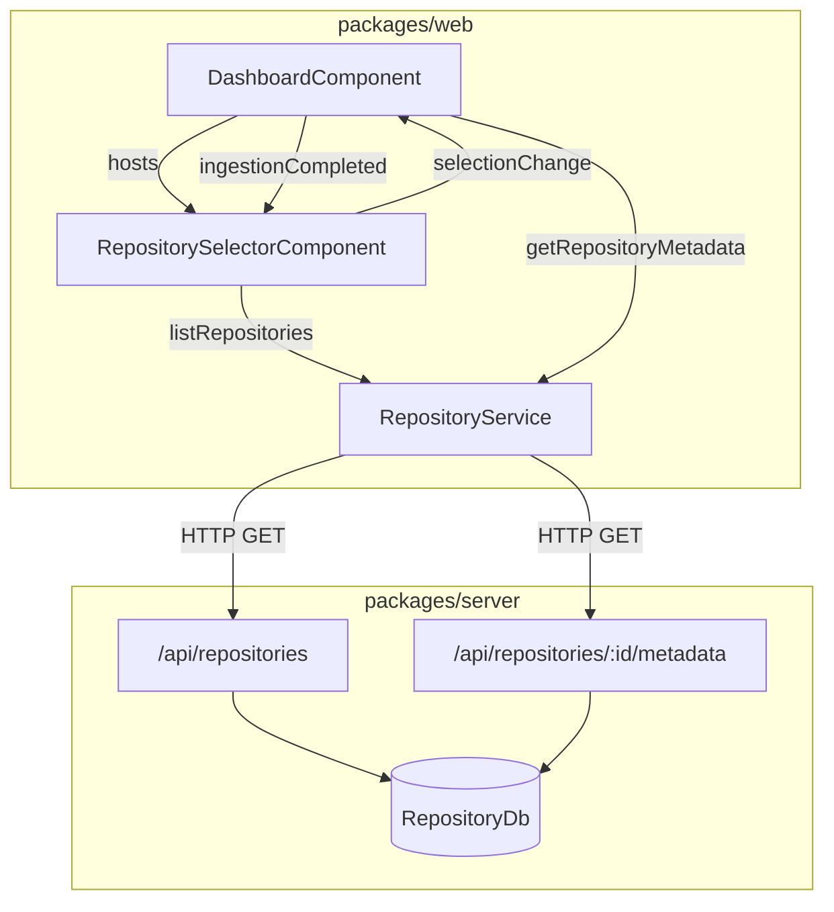

# Design Document: Repository Selector Menu

## Overview

This feature adds a repository selector dropdown to the Dashboard toolbar, allowing users to browse and select any previously ingested repository without re-triggering ingestion. The implementation spans the Angular frontend (a new `RepositorySelectorComponent` using Angular Material `mat-select`) and a minor addition to the existing `RepositoryService`. The backend already exposes `GET /api/repositories` and `GET /api/repositories/:id/metadata`, so no backend changes are needed.

The selector loads the repository list on dashboard init, displays source-type icons, and reacts to ingestion-completion events to refresh its list and auto-select the new repository.

## Architecture



### Key design decisions

1. **No backend changes required.** The `GET /api/repositories` endpoint already returns the full list with `sourceType`. The `GET /api/repositories/:id/metadata` endpoint already returns everything the dashboard panels need.

2. **New standalone component.** `RepositorySelectorComponent` is a focused, declared component in `DashboardModule`. It owns the repository list state, loading state, and error state for the list fetch. The `DashboardComponent` orchestrates metadata loading when a selection event fires.

3. **Event-driven refresh.** After ingestion completes, `DashboardComponent` already knows the new `repositoryId`. It passes this to the selector via an `@Input()`, which triggers a list refresh and auto-selection.

4. **Source type icons via MatIcon.** Each source type maps to a Material icon: `folder` (local), `code` (github), `cloud` (azure_devops). These are displayed inline in each `mat-option`.

## Components and Interfaces

### RepositorySelectorComponent

| Aspect | Detail |
|---|---|
| Selector | `app-repository-selector` |
| Module | `DashboardModule` (declared) |
| Inputs | `autoSelectId: string \| null` — when set, triggers list refresh and selects this id |
| Outputs | `selectionChange: EventEmitter<string>` — emits the selected repository id |

**Internal state:**
- `repositories: Repository[]` — fetched list
- `selectedId: string | null` — currently selected repository id
- `loading: boolean` — true while fetching list
- `errorMessage: string | null` — error text if list fetch fails

**Behavior:**
- On `ngOnInit`, calls `RepositoryService.listRepositories()` to populate the dropdown.
- On `ngOnChanges` when `autoSelectId` changes to a non-null value, re-fetches the list and sets `selectedId` to the new id.
- Emits `selectionChange` when the user picks an option.
- Shows a loading placeholder while the list is loading.
- Shows "No repositories available" in disabled state when the list is empty.
- Displays a source-type icon next to each repository name using `mat-icon`.

### RepositoryService (additions)

Add one new method:

```typescript
listRepositories(): Observable<Repository[]> {
  return this.http.get<Repository[]>(`${this.apiBase}/repositories`);
}
```

### DashboardComponent (modifications)

- Embed `<app-repository-selector>` in the toolbar area.
- On `selectionChange`, call `fetchMetadata(repositoryId)` (existing private method).
- After ingestion completes, set `autoSelectId` to the new repository id (this already partially exists in `onIngestionCompleted`).
- Track `repositoryListError` for displaying error banner when list fetch fails.

## Data Models

All data models already exist in `packages/web/src/app/dashboard/models/repository.models.ts`. The key interface used by the selector:

```typescript
// Already defined — no changes needed
export interface Repository {
  id: string;
  name: string;
  sourceType: 'local' | 'github' | 'azure_devops';
  sourceIdentifier: string;
  createdAt: string;
  updatedAt: string;
}
```

### Source type icon mapping

```typescript
const SOURCE_TYPE_ICONS: Record<Repository['sourceType'], string> = {
  local: 'folder',
  github: 'code',
  azure_devops: 'cloud',
};
```

No new backend models or database schema changes are required.


## Correctness Properties

*A property is a characteristic or behavior that should hold true across all valid executions of a system — essentially, a formal statement about what the system should do. Properties serve as the bridge between human-readable specifications and machine-verifiable correctness guarantees.*

### Property 1: Repository option rendering

*For any* list of repositories, each rendered `mat-option` in the selector SHALL use the repository's `id` as its value and display the repository's `name` as its label.

**Validates: Requirements 2.2, 2.3**

### Property 2: Metadata loads correctly on selection

*For any* repository in the selector list, selecting it SHALL result in the dashboard panels displaying that repository's languages, frameworks, and dependencies as returned by the metadata endpoint.

**Validates: Requirements 3.1, 3.2**

### Property 3: Post-ingestion refresh and auto-select

*For any* successful ingestion completion event carrying a repository id, the selector's repository list SHALL be refreshed to include that id, and the selector SHALL automatically set its selection to that id.

**Validates: Requirements 4.1, 4.2**

### Property 4: Source type icon mapping

*For any* repository, the selector SHALL display an icon corresponding to its `sourceType`, and each distinct `sourceType` value (`local`, `github`, `azure_devops`) SHALL map to a distinct icon.

**Validates: Requirements 5.1, 5.2**

## Error Handling

| Scenario | Behavior |
|---|---|
| `GET /api/repositories` returns HTTP error | Selector shows error message; dropdown is disabled. User can retry on next navigation or ingestion. |
| `GET /api/repositories/:id/metadata` returns 404 | Dashboard shows error banner "Repository not found". Previous selection is retained in the selector. |
| `GET /api/repositories/:id/metadata` returns 500 | Dashboard shows error banner "Failed to fetch metadata". Previous selection is retained. |
| Empty repository list (200 with `[]`) | Selector shows disabled state with placeholder "No repositories available". |
| Network timeout on list fetch | Same as HTTP error — error message displayed, selector disabled. |
| Ingestion completes but list refresh fails | Selector retains stale list; error message shown. The auto-select id is still set so a subsequent successful refresh will select it. |

## Testing Strategy

### Unit Tests (Jasmine + Karma — existing Angular test setup)

Unit tests cover specific examples, edge cases, and integration points:

- **RepositorySelectorComponent**: Verify loading state shown during fetch, error message on API failure, disabled state when list is empty, placeholder text "No repositories available".
- **DashboardComponent integration**: Verify that selecting a repository triggers `fetchMetadata`, verify error banner appears on metadata fetch failure, verify previous selection is retained on error.
- **RepositoryService.listRepositories**: Verify correct HTTP GET call to `/api/repositories`.

### Property-Based Tests (fast-check — already in `devDependencies`)

Each property test runs a minimum of 100 iterations using `fast-check` arbitrary generators.

Property tests reference design properties with the tag format:
**Feature: repository-selector-menu, Property {N}: {title}**

- **Property 1 test**: Generate arbitrary arrays of `Repository` objects (random ids, names, source types). Render the selector component with this data. Assert every `mat-option` value equals the corresponding `id` and every label contains the corresponding `name`.
- **Property 2 test**: Generate an arbitrary repository list and arbitrary metadata (random languages, frameworks, dependencies). Simulate selecting a random repository. Assert the dashboard panels receive exactly the metadata returned by the service.
- **Property 3 test**: Generate an arbitrary initial repository list and a new repository id (not in the list). Simulate an ingestion-completed event. Assert the refreshed list contains the new id and the selector's `selectedId` equals the new id.
- **Property 4 test**: Generate arbitrary repositories with random source types. Render the selector. Assert each repository's option contains the correct icon for its source type, and that the three source types map to three distinct icons.

### Test configuration

- Property tests: minimum 100 iterations per property (`fc.assert(fc.property(...), { numRuns: 100 })`)
- Each property test must include a comment: `// Feature: repository-selector-menu, Property N: <title>`
- Both unit and property tests run via `npm run test:web`
