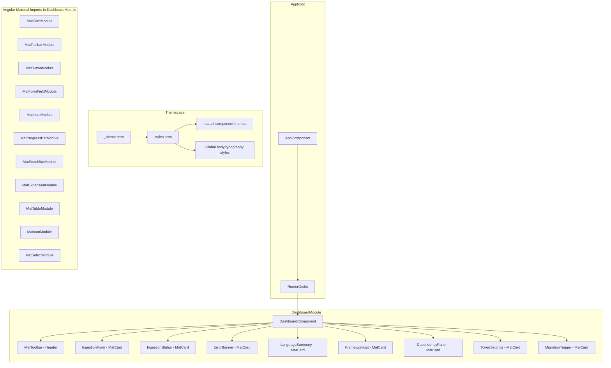
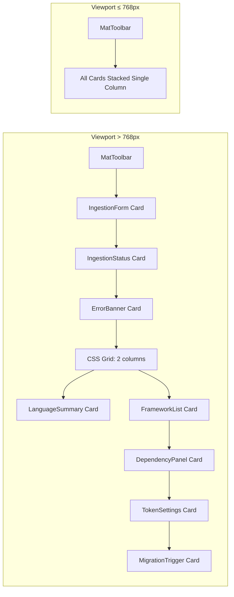

# Design Document: UI Improvements with Angular Material 3

## Overview

This design introduces Angular Material 3 (M3) theming and components to the Repository Metadata Dashboard, transforming the current flat, unstyled layout into a structured, responsive, and visually cohesive interface. The existing Angular 17 frontend uses an NgModule-based architecture with 8 dashboard child components, `@swimlane/ngx-charts` for charting, and no CSS styling or Material library. This design adds `@angular/material` as a dependency, defines a custom M3 theme, wraps each section in Material card containers, and introduces loading states, empty states, form validation, responsive layout, and interaction feedback using Material components.

### Key Design Decisions

1. **NgModule integration**: The existing `DashboardModule` declares all components. Angular Material modules (e.g., `MatCardModule`, `MatToolbarModule`) will be imported into `DashboardModule` rather than converting to standalone components, preserving the current architecture.
2. **SCSS theme file**: A new `_theme.scss` file will define the M3 theme using `mat.defineTheme()` with a blue seed color. The global `styles.css` will be renamed to `styles.scss` to import the theme and apply it via `@include mat.all-component-themes()`.
3. **Inline templates retained**: The existing components use inline templates. Material directives and components will be added directly to these inline templates.
4. **Snackbar service**: `MatSnackBar` will be injected into components that need success/error feedback (IngestionForm, TokenSettings) rather than creating a shared notification service, keeping changes minimal.
5. **Skeleton loaders**: Implemented using `mat-progress-bar` in indeterminate mode inside `mat-card` containers, toggled by a loading state flag on the dashboard.

## Architecture



### Responsive Layout Strategy



## Components and Interfaces

### Modified Files

| File | Changes |
|------|---------|
| `frontend/package.json` | Add `@angular/material` dependency |
| `frontend/angular.json` | Update `styles` array from `styles.css` to `styles.scss` |
| `frontend/src/styles.css` → `styles.scss` | Import M3 theme, apply global theme, body background, typography |
| `frontend/src/index.html` | Add Material Symbols icon font link, Roboto font link |
| `frontend/src/app/dashboard/dashboard.module.ts` | Import all required Angular Material modules |
| `frontend/src/app/dashboard/dashboard.component.ts` | Add `mat-toolbar`, wrap sections in `mat-card`, add CSS grid layout, loading state, empty state, snackbar on ingestion complete |
| `frontend/src/app/dashboard/components/ingestion-form/ingestion-form.component.ts` | Wrap input in `mat-form-field` with outline appearance, use `mat-flat-button`, add `mat-progress-bar`, add `mat-error` validation, inject `MatSnackBar` |
| `frontend/src/app/dashboard/components/ingestion-status/ingestion-status.component.ts` | Minimal changes - content renders inside parent's `mat-card` |
| `frontend/src/app/dashboard/components/error-banner/error-banner.component.ts` | Style with M3 error-container color token |
| `frontend/src/app/dashboard/components/language-summary/language-summary.component.ts` | Add `mat-icon` empty state, skeleton loader support |
| `frontend/src/app/dashboard/components/framework-list/framework-list.component.ts` | Replace HTML table with `mat-table`, add `mat-icon` empty state, skeleton loader support |
| `frontend/src/app/dashboard/components/dependency-panel/dependency-panel.component.ts` | Replace HTML table with `mat-table`, replace custom accordion with `mat-accordion`/`mat-expansion-panel`, add Expand All/Collapse All buttons, add `mat-icon` empty state |
| `frontend/src/app/dashboard/components/token-settings/token-settings.component.ts` | Wrap inputs in `mat-form-field` with outline appearance, use `mat-flat-button`/`mat-stroked-button`, add `mat-error` validation, inject `MatSnackBar` |
| `frontend/src/app/dashboard/components/migration-trigger/migration-trigger.component.ts` | Wrap select in `mat-form-field` with `mat-select`, use `mat-flat-button`, add `mat-error` validation |

### New Files

| File | Purpose |
|------|---------|
| `frontend/src/_theme.scss` | M3 theme definition using `mat.defineTheme()` with blue seed color |

### Theme Definition (`_theme.scss`)

```scss
@use '@angular/material' as mat;

$app-theme: mat.define-theme((
  color: (
    theme-type: light,
    primary: mat.$blue-palette,
  ),
  typography: (
    brand-family: 'Roboto',
    plain-family: 'Roboto',
  ),
  density: (
    scale: 0,
  ),
));
```

### Global Styles (`styles.scss`)

```scss
@use './theme' as *;
@use '@angular/material' as mat;

html {
  @include mat.all-component-themes($app-theme);
}

body {
  margin: 0;
  font-family: Roboto, sans-serif;
  background-color: var(--mat-sys-surface);
  color: var(--mat-sys-on-surface);
  line-height: 1.5;
}

mat-card {
  background-color: var(--mat-sys-surface-container);
}
```

### Dashboard Component Layout

The `DashboardComponent` template will use a CSS class-based layout:

```html
<mat-toolbar color="primary">
  <span class="toolbar-title">Repository Metadata Dashboard</span>
</mat-toolbar>

<div class="dashboard-container">
  <!-- Ingestion Form Card -->
  <mat-card class="dashboard-card full-width">
    <mat-card-header><mat-card-title>Ingest Repository</mat-card-title></mat-card-header>
    <mat-card-content>
      <app-ingestion-form (ingestionTriggered)="onIngestionTriggered($event)"></app-ingestion-form>
    </mat-card-content>
  </mat-card>

  <!-- Empty state when no ingestion triggered -->
  <p *ngIf="!ingestionId && !repositoryId" class="empty-prompt mat-body-medium">
    Enter a repository path or URL above to get started
  </p>

  <!-- Ingestion Status Card -->
  <mat-card *ngIf="ingestionId" class="dashboard-card full-width">...</mat-card>

  <!-- Error Banner Card -->
  <mat-card *ngIf="errors" class="dashboard-card full-width error-card">...</mat-card>

  <!-- Side-by-side grid for Language + Framework -->
  <div class="two-column-grid">
    <mat-card class="dashboard-card">
      <app-language-summary [languages]="languages" [loading]="loadingMetadata"></app-language-summary>
    </mat-card>
    <mat-card class="dashboard-card">
      <app-framework-list [frameworks]="frameworks" [loading]="loadingMetadata"></app-framework-list>
    </mat-card>
  </div>

  <!-- Dependency Panel Card -->
  <mat-card class="dashboard-card full-width">
    <app-dependency-panel [dependencies]="dependencies" [loading]="loadingMetadata"></app-dependency-panel>
  </mat-card>

  <!-- Token Settings Card -->
  <mat-card class="dashboard-card full-width">
    <app-token-settings></app-token-settings>
  </mat-card>

  <!-- Migration Trigger Card -->
  <mat-card class="dashboard-card full-width">
    <app-migration-trigger [repositoryId]="repositoryId"></app-migration-trigger>
  </mat-card>
</div>
```

### Dashboard CSS

```css
.dashboard-container {
  max-width: 1200px;
  margin: 24px auto;
  padding: 0 16px;
  display: flex;
  flex-direction: column;
  gap: 16px;
}

.two-column-grid {
  display: grid;
  grid-template-columns: 1fr 1fr;
  gap: 16px;
}

@media (max-width: 768px) {
  .two-column-grid {
    grid-template-columns: 1fr;
  }
}
```

### DependencyPanel with Mat Expansion Panel

```html
<mat-card-header>
  <mat-card-title>Dependencies</mat-card-title>
</mat-card-header>
<mat-card-content>
  <div *ngIf="!hasDependencies" class="empty-state">
    <mat-icon>inventory_2</mat-icon>
    <p>No dependencies found</p>
  </div>
  <div *ngIf="hasDependencies">
    <div class="panel-actions">
      <button mat-stroked-button (click)="expandAll()">Expand All</button>
      <button mat-stroked-button (click)="collapseAll()">Collapse All</button>
    </div>
    <mat-accordion multi>
      <mat-expansion-panel *ngFor="let group of ecosystemGroups">
        <mat-expansion-panel-header>
          <mat-panel-title>{{ group.ecosystem }}</mat-panel-title>
          <mat-panel-description>{{ group.dependencies.length }} dependencies</mat-panel-description>
        </mat-expansion-panel-header>
        <mat-table [dataSource]="group.dependencies">
          <ng-container matColumnDef="name">
            <mat-header-cell *matHeaderCellDef>Name</mat-header-cell>
            <mat-cell *matCellDef="let dep">{{ dep.name }}</mat-cell>
          </ng-container>
          <!-- ... version, type columns ... -->
          <mat-header-row *matHeaderRowDef="depColumns"></mat-header-row>
          <mat-row *matRowDef="let row; columns: depColumns;"></mat-row>
        </mat-table>
      </mat-expansion-panel>
    </mat-accordion>
  </div>
</mat-card-content>
```

## Data Models

No new data models are required. The existing models in `repository.models.ts` remain unchanged. The UI improvements are purely presentational and use the same data interfaces:

- `RepositoryLanguage` - drives LanguageSummary chart and empty state
- `RepositoryFramework` - drives FrameworkList mat-table and empty state
- `RepositoryDependency` - drives DependencyPanel mat-expansion-panel groups and mat-table
- `IngestionRecord` - drives IngestionStatus display and snackbar trigger
- `MigrationStatus` - drives MigrationTrigger status display

### New Component State Properties

| Component | New Property | Type | Purpose |
|-----------|-------------|------|---------|
| `DashboardComponent` | `loadingMetadata` | `boolean` | Controls skeleton loader visibility in Language, Framework, Dependency cards |
| `IngestionFormComponent` | (uses existing `loading`) | `boolean` | Controls progress bar and button disable state |
| `DependencyPanelComponent` | `loading` | `@Input() boolean` | Controls skeleton loader in dependency card |
| `DependencyPanelComponent` | `accordion` | `@ViewChild(MatAccordion)` | Reference for Expand All / Collapse All |
| `LanguageSummaryComponent` | `loading` | `@Input() boolean` | Controls skeleton loader |
| `FrameworkListComponent` | `loading` | `@Input() boolean` | Controls skeleton loader |
| `FrameworkListComponent` | `displayedColumns` | `string[]` | Column definitions for mat-table |

## Correctness Properties

*A property is a characteristic or behavior that should hold true across all valid executions of a system — essentially, a formal statement about what the system should do. Properties serve as the bridge between human-readable specifications and machine-verifiable correctness guarantees.*

Most acceptance criteria in this feature are visual/structural UI requirements (CSS classes, DOM structure, responsive breakpoints) that are best validated through example-based tests rather than property-based tests. However, three properties emerge from the requirements that apply universally across inputs:

### Property 1: Form field outline appearance

*For any* `mat-form-field` rendered in the dashboard (across IngestionForm, TokenSettings, and MigrationTrigger), the `appearance` attribute shall be set to `"outline"`.

**Validates: Requirements 3.5**

### Property 2: Snackbar auto-dismiss duration

*For any* `MatSnackBar.open()` call made by any component in the dashboard, the configuration object shall include a `duration` value of `5000` milliseconds.

**Validates: Requirements 4.6**

### Property 3: Dependency ecosystem grouping with header content

*For any* non-empty array of `RepositoryDependency` objects, the `DependencyPanelComponent` shall group them by ecosystem and render one `mat-expansion-panel` per group, where each panel header contains the ecosystem name and the correct count of dependencies in that group.

**Validates: Requirements 6.1, 6.2**

## Error Handling

| Scenario | Handling |
|----------|----------|
| Ingestion form submitted with empty/whitespace input | `mat-error` displays "Repository path or URL is required" inside `mat-form-field`. Submit button remains disabled when input is empty. |
| Ingestion API returns error | Error message displayed in a `mat-card` styled with `error-container` color token. The `mat-progress-bar` is hidden and submit button re-enabled. |
| Metadata fetch fails after ingestion | `ErrorBannerComponent` renders inside a `mat-card` with error styling. Skeleton loaders are removed. |
| Token save with no tokens entered | `mat-error` displays "Enter at least one token to save". Save button is disabled when both fields are empty. |
| Token save API fails | Error message displayed via existing `errorMessage` property, styled with M3 error color token. |
| Migration triggered without selecting type | `mat-error` displays "Select a migration type". Trigger button remains disabled via existing `canTrigger()` guard. |
| Migration API fails | Error message displayed via existing `errorMessage` property with `role="alert"`. |
| Angular Material module not loaded | Build-time error — caught during `ng build`. Not a runtime concern. |

## Testing Strategy

### Unit Tests (Jasmine + Karma)

Unit tests should cover specific examples and edge cases:

- **Theme setup**: Verify `@angular/material` is in `package.json` dependencies. Verify `index.html` includes Material Symbols font link.
- **Dashboard layout**: Verify `mat-toolbar` renders with title text "Repository Metadata Dashboard". Verify each section is wrapped in `mat-card`. Verify the two-column grid class is applied to Language/Framework container.
- **Loading states**: Verify `mat-progress-bar` appears when `loading` is true on IngestionForm. Verify submit button is disabled during loading. Verify skeleton loaders appear in Language, Framework, Dependency cards when `loadingMetadata` is true.
- **Empty states**: Verify empty state messages render with correct text and `mat-icon` when data arrays are null/empty. Verify "Enter a repository path or URL above to get started" message when no ingestion triggered.
- **Snackbar**: Verify `MatSnackBar.open()` is called with correct message on ingestion complete and token save. Verify duration is 5000ms.
- **Form validation**: Verify `mat-error` messages appear for empty ingestion input, empty token fields, and missing migration type.
- **Responsive typography**: Verify toolbar title has appropriate typography class.
- **Button directives**: Verify primary buttons use `mat-flat-button` and secondary buttons use `mat-stroked-button`.
- **Dependency panel**: Verify `mat-accordion` renders with `mat-expansion-panel` per ecosystem. Verify Expand All / Collapse All buttons exist and function.
- **Table rendering**: Verify `mat-table` is used in FrameworkList and DependencyPanel with correct column definitions.

### Property-Based Tests (fast-check)

The project should use `fast-check` as the property-based testing library for TypeScript/Angular.

Each property test must:
- Run a minimum of 100 iterations
- Reference the design property with a comment tag
- Be implemented as a single test per property

**Property test implementations:**

1. **Feature: ui-improvements, Property 1: Form field outline appearance**
   - Generate random sets of form field configurations. For each rendered `mat-form-field` in the dashboard, assert `appearance === 'outline'`.
   - In practice: query all `mat-form-field` elements in the compiled dashboard template and verify the attribute.

2. **Feature: ui-improvements, Property 2: Snackbar auto-dismiss duration**
   - Spy on `MatSnackBar.open()`. Trigger various success scenarios (random ingestion completions, random token saves). For each call, assert the duration config is 5000.

3. **Feature: ui-improvements, Property 3: Dependency ecosystem grouping with header content**
   - Generate random arrays of `RepositoryDependency` objects with random ecosystem names and counts. Pass them to `DependencyPanelComponent`. Assert that the number of `mat-expansion-panel` elements equals the number of unique ecosystems, and each panel header contains the ecosystem name and correct dependency count.

### Test Configuration

- Testing framework: Jasmine + Karma (existing project setup)
- Property-based testing library: `fast-check` (to be added as dev dependency)
- Minimum iterations per property test: 100
- Tag format: `Feature: ui-improvements, Property {number}: {property_text}`
